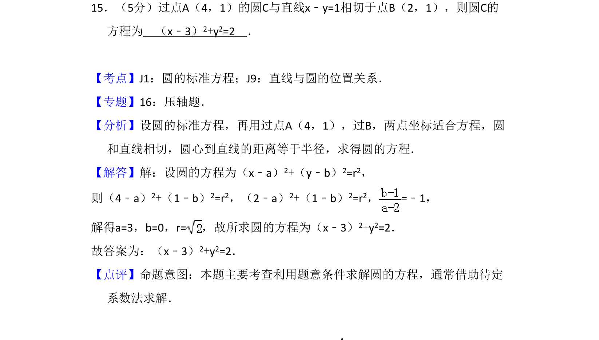
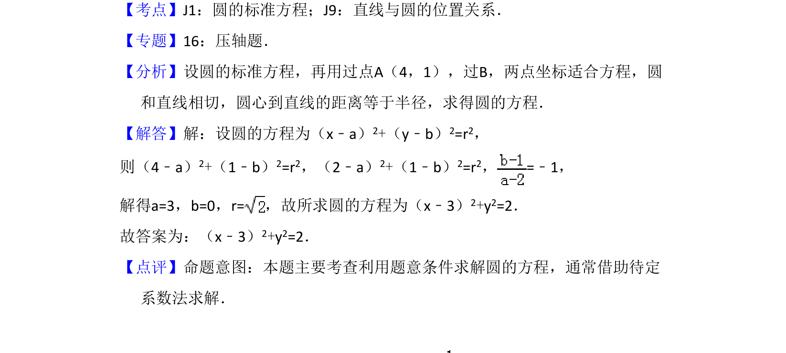

## 题面

## 摘要

根据点与坐标、相切条件，利用待定系数法求解圆的标准方程。

## 关联考点

- [[373-圆的标准方程|圆的标准方程]]
- [[394-直线和圆位置关系-高中|直线与圆的位置关系]]
- [[570-点到直线的距离公式|点到直线距离公式]]

## 答案与解析

> 📄 原 PDF 第 11 页：`素材/真题/吉林/2008-2024·（吉林）数学高考真题/2010年高考数学试卷（理）（新课标）（解析卷）.pdf`

<!-- 题干文本-start -->
## 题干文本
15．（5分）过点A（4，1）的圆C与直线x﹣y=1相切于点B（2，1），则圆C的
方程为　（x﹣3）2+y2=2　．
<!-- 题干文本-end -->

<!-- 解析文本-start -->
## 解析文本
【考点】J1：圆的标准方程；J9：直线与圆的位置关系．菁优网版权所有
【专题】16：压轴题．
【分析】设圆的标准方程，再用过点A（4，1），过B，两点坐标适合方程，圆
和直线相切，圆心到直线的距离等于半径，求得圆的方程．
【解答】解：设圆的方程为（x﹣a）2+（y﹣b）2=r2，
则（4﹣a）2+（1﹣b）2=r2，（2﹣a）2+（1﹣b）2=r2，=﹣1，
解得a=3，b=0，r=，故所求圆的方程为（x﹣3） 2+y2=2．
故答案为：（x﹣3）2+y2=2．
【点评】命题意图：本题主要考查利用题意条件求解圆的方程，通常借助待定
系数法求解．
<!-- 解析文本-end -->
