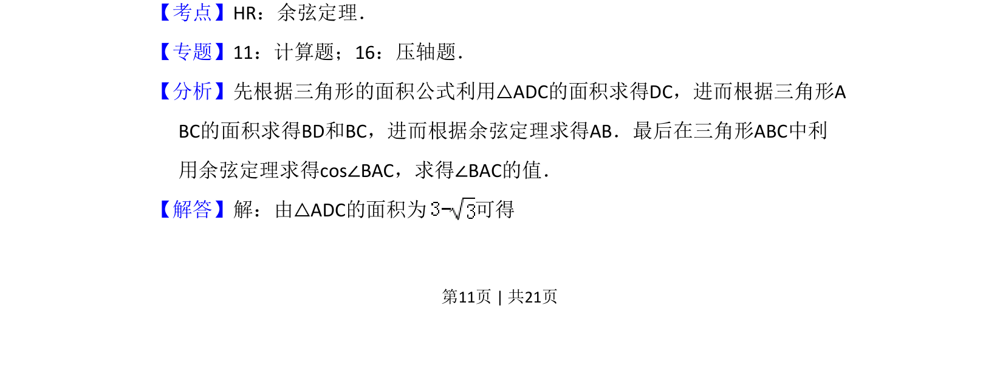
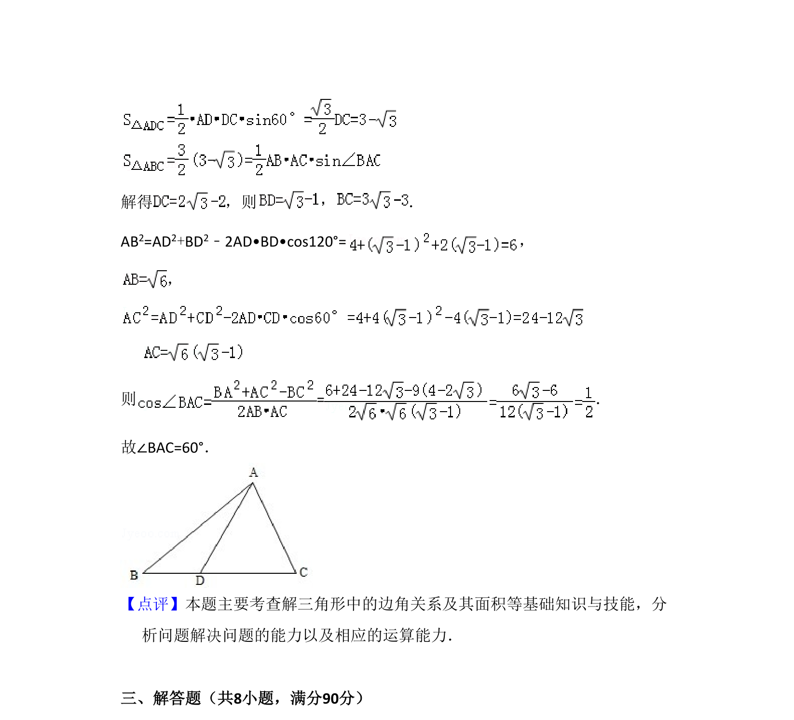

## 题面

## 摘要

在三角形中结合面积公式与余弦定理求解角度。

## 关联考点

- [[126-定理|余弦定理]]
- [[619-三角形面积公式|三角形面积公式]]
- [[589-解三角形|解三角形]]

## 答案与解析

> 📄 原 PDF 第 11 页：`素材/真题/吉林/2008-2024·（吉林）数学高考真题/2010年高考数学试卷（理）（新课标）（解析卷）.pdf`

<!-- 题干文本-start -->
## 题干文本
16．（5分）在△ABC中，D为边BC上一点，BD= DC，∠ADB=120°，AD=2，若△
ADC的面积为 ，则∠BAC=　60°　．
<!-- 题干文本-end -->

<!-- 解析文本-start -->
## 解析文本
【考点】HR：余弦定理．菁优网版权所有
【专题】11：计算题；16：压轴题．
【分析】先根据三角形的面积公式利用△ADC的面积求得DC，进而根据三角形A
BC的面积求得BD和BC，进而根据余弦定理求得AB．最后在三角形ABC中利
用余弦定理求得cos∠BAC，求得∠BAC的值．
【解答】解：由△ADC的面积为 可得
<!-- 解析文本-end -->
