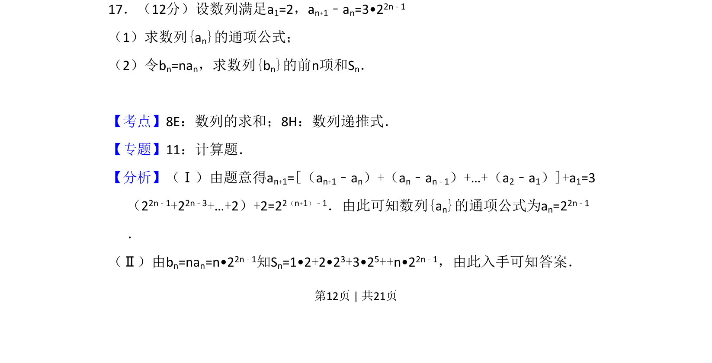
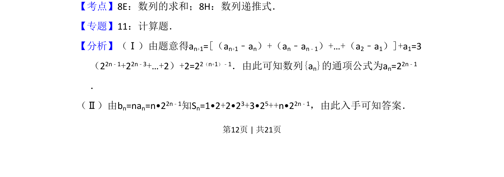
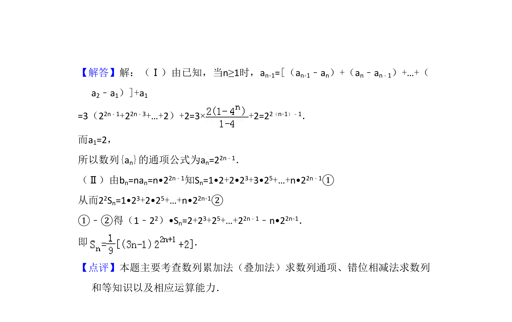

## 题面

## 摘要

数列递推求通项公式及错位相减法求和

## 关联考点

- [[894-数列递推式|数列递推式]]
- [[1081-累加求和|数列求和]]
- [[385-数列错位相减|错位相减法]]

## 答案与解析

> 📄 原 PDF 第 12 页：`素材/真题/吉林/2008-2024·（吉林）数学高考真题/2010年高考数学试卷（理）（新课标）（解析卷）.pdf`

<!-- 题干文本-start -->
## 题干文本
17．（12分）设数列满足a1=2，an+1﹣an=3•22n﹣1
（1）求数列{an}的通项公式；
（2）令bn=nan，求数列{bn}的前n项和Sn．
<!-- 题干文本-end -->

<!-- 解析文本-start -->
## 解析文本
【考点】8E：数列的求和；8H：数列递推式．菁优网版权所有
【专题】11：计算题．
【分析】（Ⅰ）由题意得an+1=[（an+1﹣an）+（an﹣an﹣1）+…+（a2﹣a1）]+a1=3
（22n﹣1+22n﹣3+…+2）+2=22（n+1）﹣1．由此可知数列{an}的通项公式为an=22n﹣1
．
（Ⅱ）由bn=nan=n•22n﹣1知Sn=1•2+2•23+3•25++n•22n﹣1，由此入手可知答案．
<!-- 解析文本-end -->
