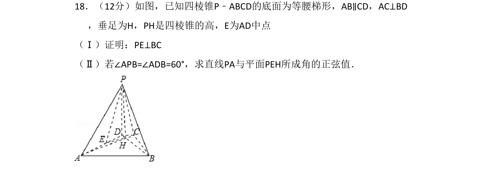
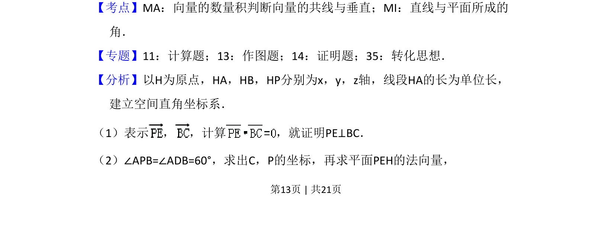

## 题面

## 摘要

以四棱锥为载体，考查垂直关系的向量证明和线面角的正弦值计算

## 关联考点

- [[向量数量积]]
- [[直线与平面所成角]]
- [[399-空间向量坐标表示|空间直角坐标系]]

## 答案与解析

> 📄 原 PDF 第 13 页：`素材/真题/吉林/2008-2024·（吉林）数学高考真题/2010年高考数学试卷（理）（新课标）（解析卷）.pdf`
