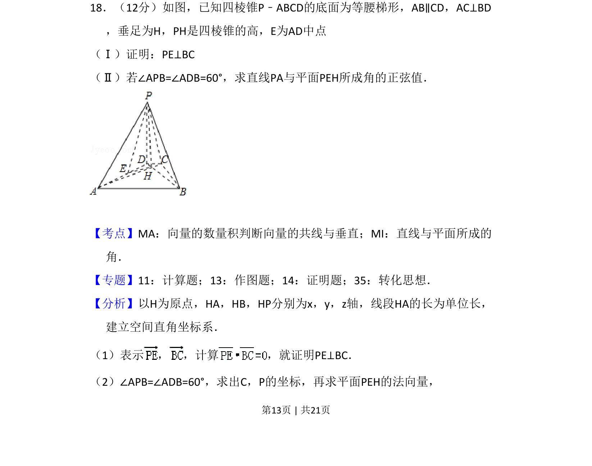
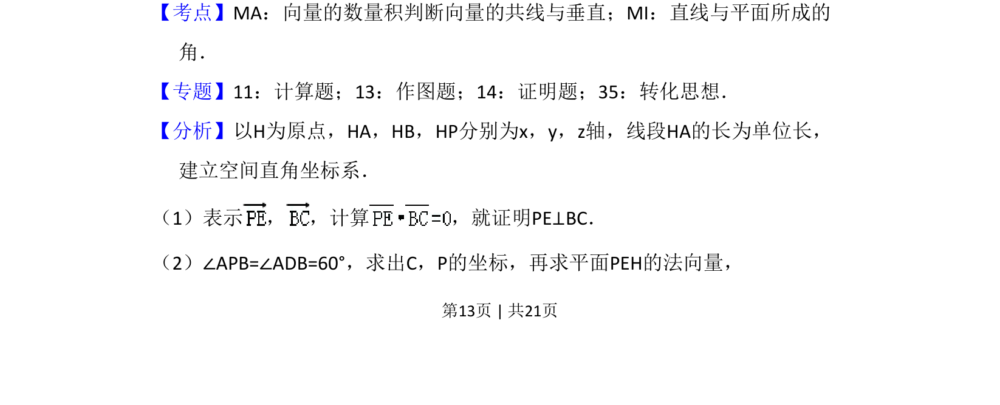
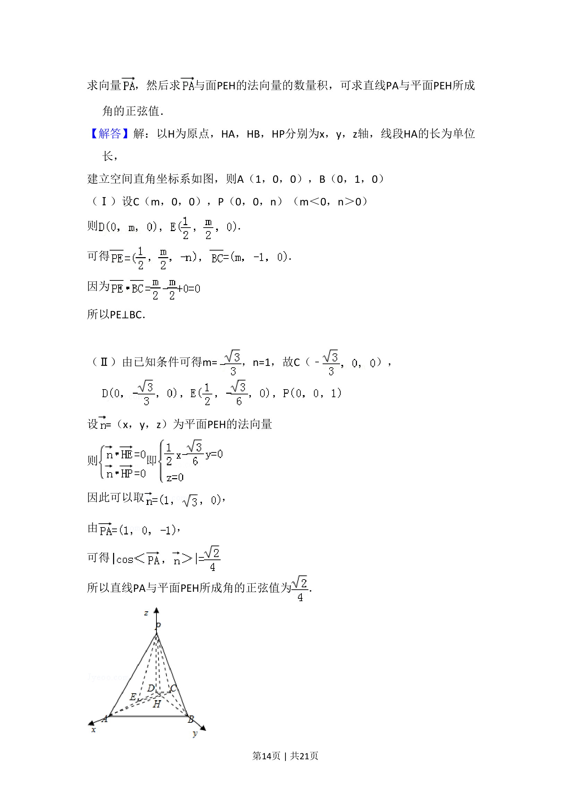
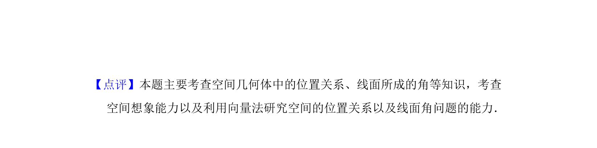

## 题面

## 摘要

以四棱锥为载体，考查垂直关系的向量证明和线面角的正弦值计算

## 关联考点

- [[328-向量的数量积|向量数量积]]
- [[1013-直线与平面所成的角|直线与平面所成角]]
- [[399-空间向量坐标表示|空间直角坐标系]]

## 答案与解析

> 📄 原 PDF 第 13 页：`素材/真题/吉林/2008-2024·（吉林）数学高考真题/2010年高考数学试卷（理）（新课标）（解析卷）.pdf`

<!-- 题干文本-start -->
## 题干文本
18．（12分）如图，已知四棱锥P﹣ABCD的底面为等腰梯形，AB∥CD，AC⊥BD
，垂足为H，PH是四棱锥的高，E为AD中点
（Ⅰ）证明：PE⊥BC
（Ⅱ）若∠APB=∠ADB=60°，求直线PA与平面PEH所成角的正弦值．
<!-- 题干文本-end -->

<!-- 解析文本-start -->
## 解析文本
【考点】MA：向量的数量积判断向量的共线与垂直；MI：直线与平面所成的
角．菁优网版权所有
【专题】11：计算题；13：作图题；14：证明题；35：转化思想．
【分析】以H为原点，HA，HB，HP分别为x，y，z轴，线段HA的长为单位长，
建立空间直角坐标系．
（1）表示 ， ，计算 ，就证明PE⊥BC．
（2）∠APB=∠ADB=60°，求出C，P的坐标，再求平面PEH的法向量，
<!-- 解析文本-end -->
