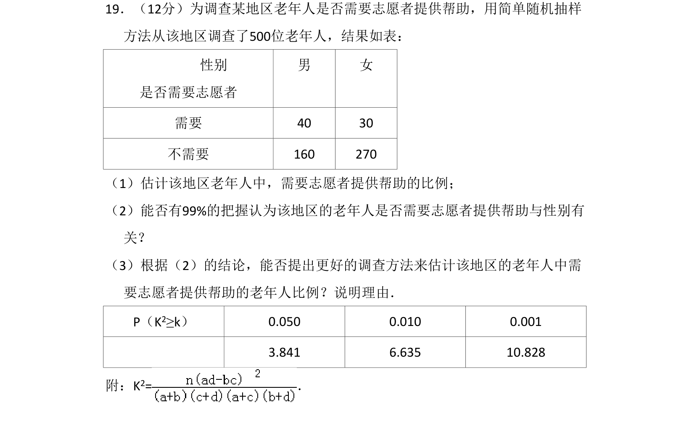
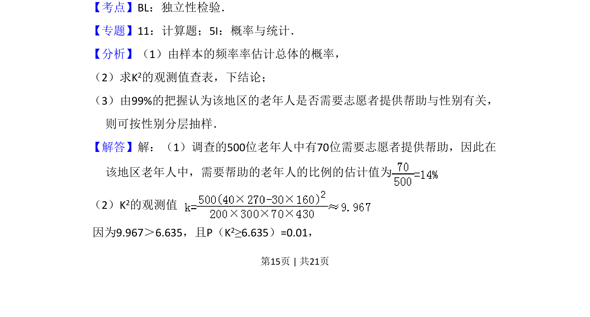
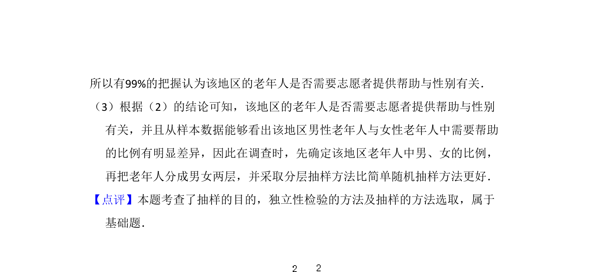

## 题面

## 摘要

本题通过2×2列联表数据，考查独立性检验和总体比例估计，并引出抽样方法改进。

## 关联考点

- [[497-独立性检验|独立性检验]]
- [[319-分层抽样|分层抽样]]
- [[1208-比例估计|比例估计]]

## 答案与解析

> 📄 原 PDF 第 15 页：`素材/真题/吉林/2008-2024·（吉林）数学高考真题/2010年高考数学试卷（理）（新课标）（解析卷）.pdf`
