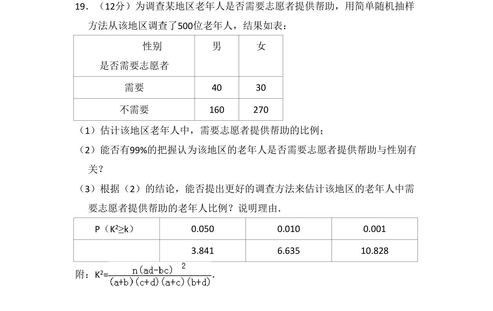
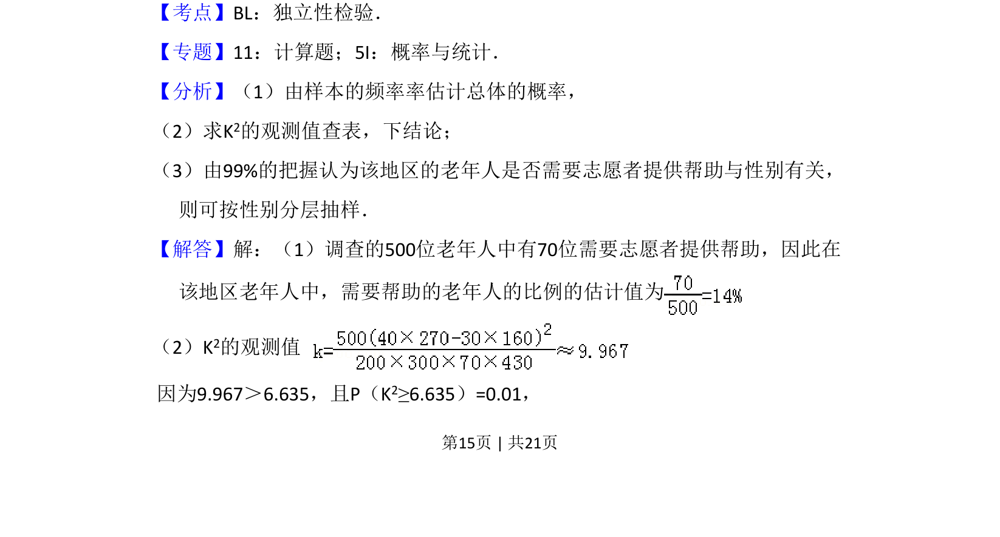
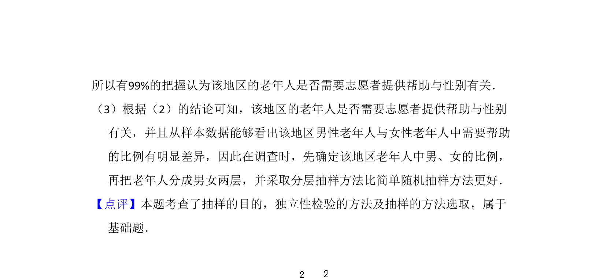

## 题面

## 摘要

本题通过2×2列联表数据，考查独立性检验和总体比例估计，并引出抽样方法改进。

## 关联考点

- [[497-独立性检验|独立性检验]]
- [[319-分层抽样|分层抽样]]
- [[1208-比例估计|比例估计]]

## 答案与解析

> 📄 原 PDF 第 15 页：`素材/真题/吉林/2008-2024·（吉林）数学高考真题/2010年高考数学试卷（理）（新课标）（解析卷）.pdf`

<!-- 题干文本-start -->
## 题干文本
19．（12分）为调查某地区老年人是否需要志愿者提供帮助，用简单随机抽样
方法从该地区调查了500位老年人，结果如表：
                性别
是否需要志愿者
男 女
需要 40 30
不需要 160 270
（1）估计该地区老年人中，需要志愿者提供帮助的比例；
（2）能否有99%的把握认为该地区的老年人是否需要志愿者提供帮助与性别有
关？
（3）根据（2）的结论，能否提出更好的调查方法来估计该地区的老年人中需
要志愿者提供帮助的老年人比例？说明理由．
P（K2≥k） 0.050 0.010 0.001
3.841 6.635 10.828
附：K2=．
<!-- 题干文本-end -->

<!-- 解析文本-start -->
## 解析文本
【考点】BL：独立性检验．菁优网版权所有
【专题】11：计算题；5I：概率与统计．
【分析】（1）由样本的频率率估计总体的概率，
（2）求K2的观测值查表，下结论；
（3）由99%的把握认为该地区的老年人是否需要志愿者提供帮助与性别有关，
则可按性别分层抽样．
【解答】解：（1）调查的500位老年人中有70位需要志愿者提供帮助，因此在
该地区老年人中，需要帮助的老年人的比例的估计值为     
（2）K2的观测值  
 因为9.967＞6.635，且P（K2≥6.635）=0.01，
<!-- 解析文本-end -->
