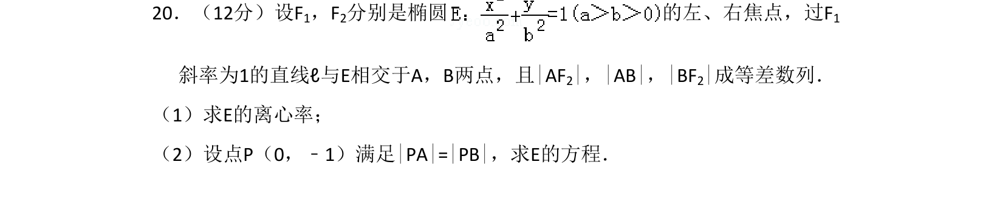
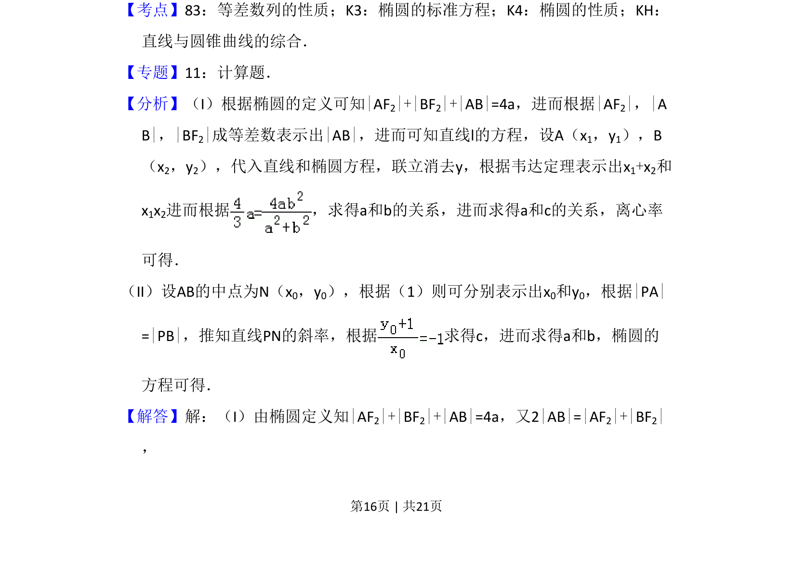
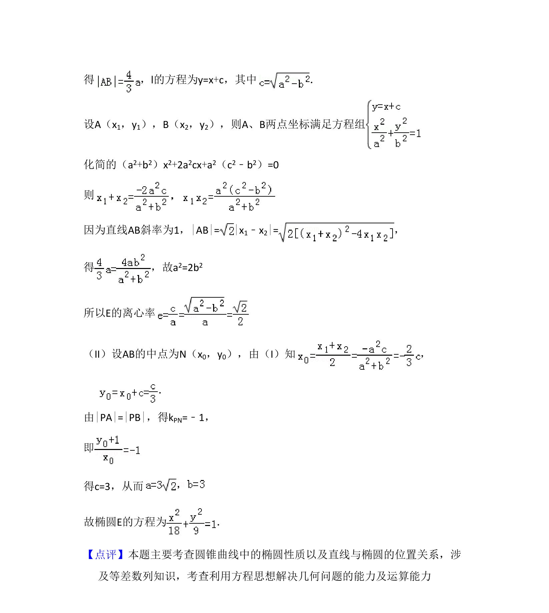

## 题面

## 摘要

椭圆焦点弦与等差数列结合，求离心率和方程，涉及弦中点与垂直关系。

## 关联考点

- [[944-椭圆的性质|椭圆的性质]]
- [[356-等差数列概念|等差数列]]
- [[1009-直线与圆锥曲线综合|直线与圆锥曲线综合]]

## 答案与解析

> 📄 原 PDF 第 16 页：`素材/真题/吉林/2008-2024·（吉林）数学高考真题/2010年高考数学试卷（理）（新课标）（解析卷）.pdf`
