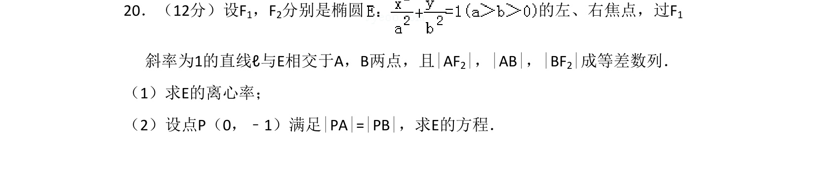
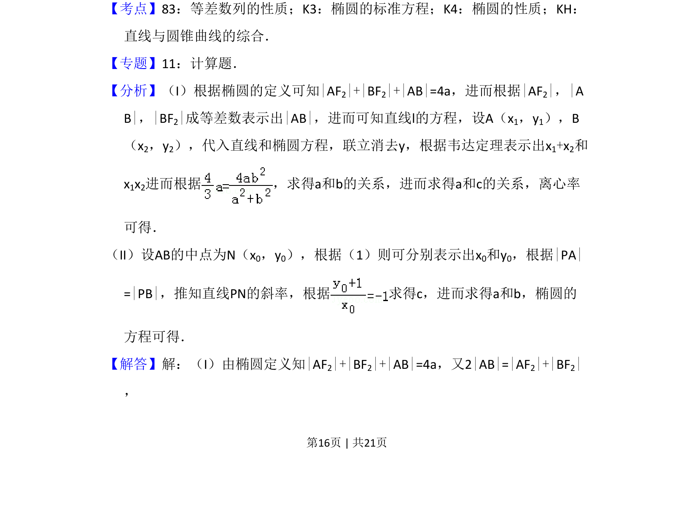
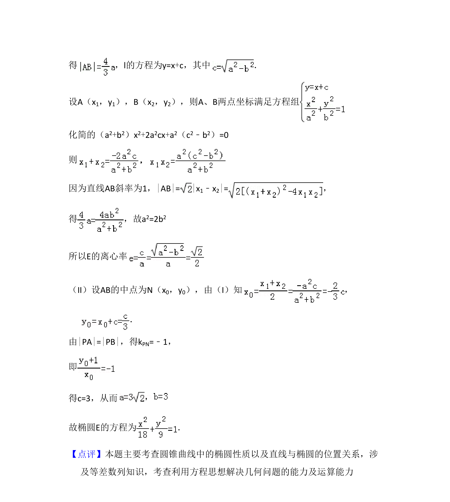

## 题面

## 摘要

椭圆焦点弦与等差数列结合，求离心率和方程，涉及弦中点与垂直关系。

## 关联考点

- [[944-椭圆的性质|椭圆的性质]]
- [[356-等差数列概念|等差数列]]
- [[1007-直线与圆锥曲线的综合|直线与圆锥曲线综合]]

## 答案与解析

> 📄 原 PDF 第 16 页：`素材/真题/吉林/2008-2024·（吉林）数学高考真题/2010年高考数学试卷（理）（新课标）（解析卷）.pdf`

<!-- 题干文本-start -->
## 题干文本
20．（12分）设F1，F2分别是椭圆 的左、右焦点，过F 1
斜率为1的直线ℓ与E相交于A，B两点，且|AF2|，|AB|，|BF2|成等差数列．
（1）求E的离心率；
（2）设点P（0，﹣1）满足|PA|=|PB|，求E的方程．
<!-- 题干文本-end -->

<!-- 解析文本-start -->
## 解析文本
【考点】83：等差数列的性质；K3：椭圆的标准方程；K4：椭圆的性质；KH：
直线与圆锥曲线的综合．菁优网版权所有
【专题】11：计算题．
【分析】（I）根据椭圆的定义可知|AF2|+|BF2|+|AB|=4a，进而根据|AF2|，|A
B|，|BF2|成等差数表示出|AB|，进而可知直线l的方程，设A（x1，y1），B
（x2，y2），代入直线和椭圆方程，联立消去y，根据韦达定理表示出x1+x2和
x1x2进而根据 ，求得a和b的关系，进而求得a和c的关系，离心率
可得．
（II）设AB的中点为N（x0，y0），根据（1）则可分别表示出x0和y0，根据|PA|
=|PB|，推知直线PN的斜率，根据 求得c，进而求得a和b，椭圆的
方程可得．
【解答】解：（I）由椭圆定义知|AF2|+|BF2|+|AB|=4a，又2|AB|=|AF2|+|BF2|
，
<!-- 解析文本-end -->
