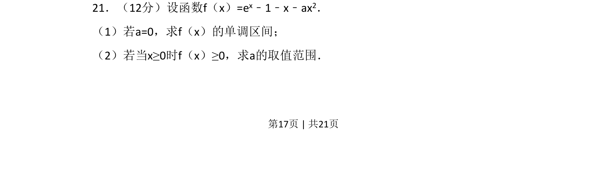
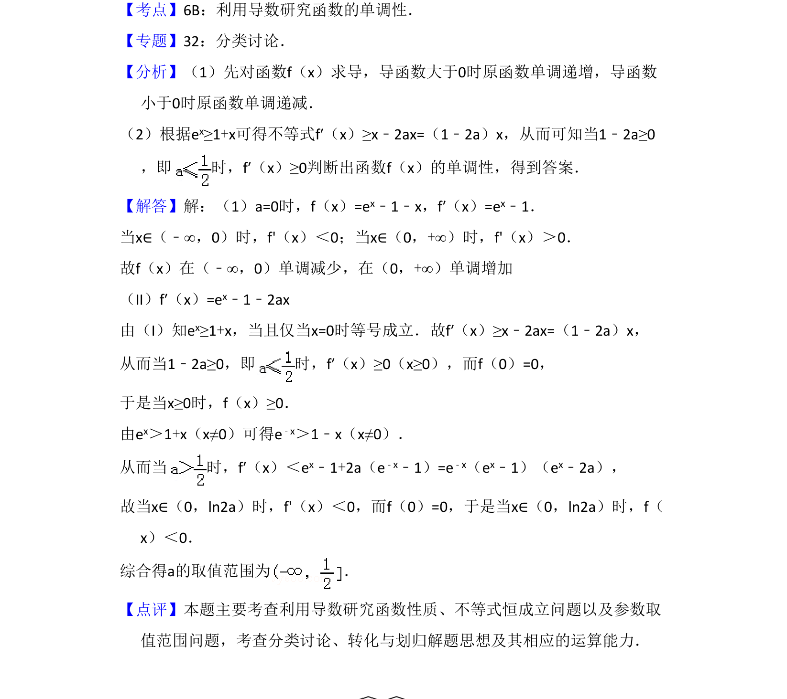

## 题面

## 摘要

利用导数研究含参函数的单调区间，并求解恒成立条件下参数的取值范围。

## 关联考点

- [[425-反函数导数|导数]]
- [[432-导数与函数单调性|函数单调性]]
- [[450-恒成立问题|恒成立问题]]
- [[726-参数范围|参数范围]]

## 答案与解析

> 📄 原 PDF 第 17 页：`素材/真题/吉林/2008-2024·（吉林）数学高考真题/2010年高考数学试卷（理）（新课标）（解析卷）.pdf`
