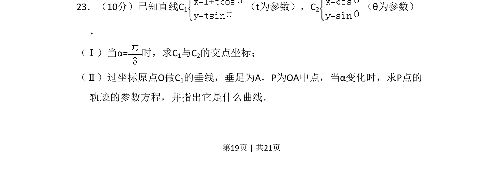
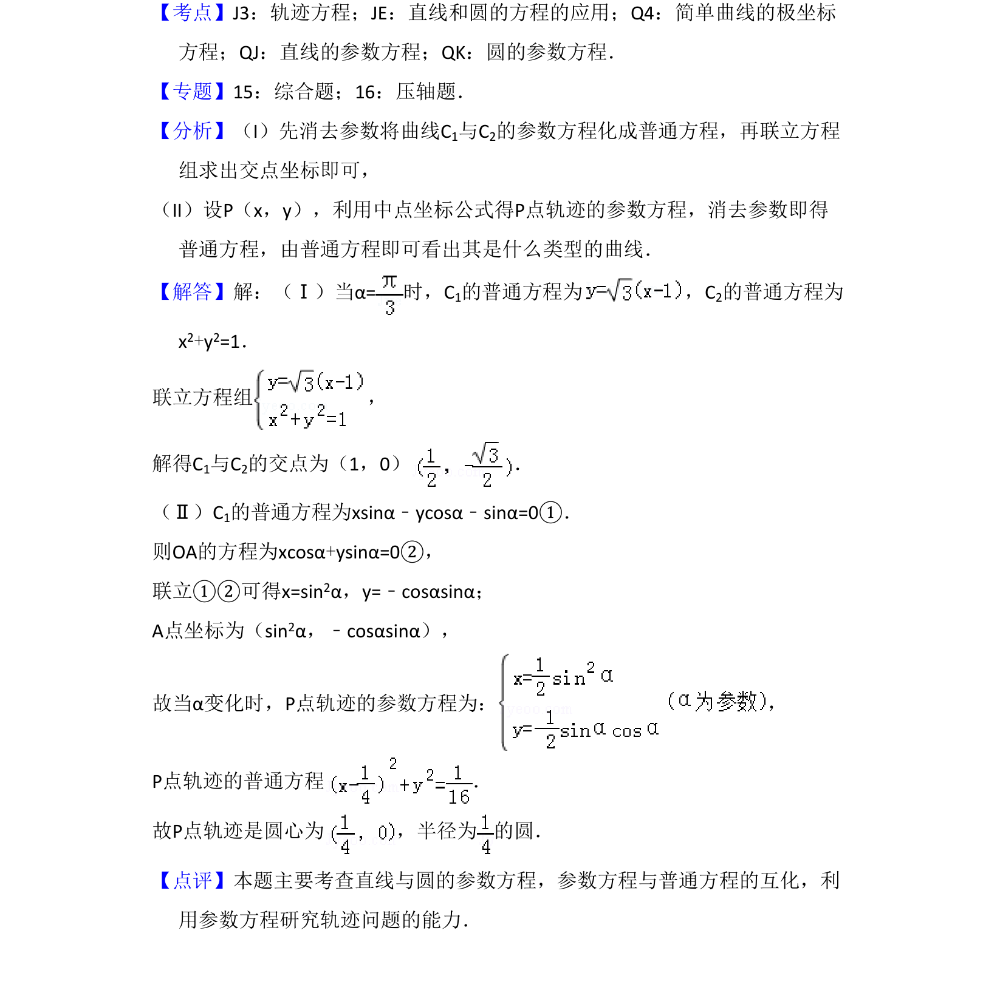

## 题面

## 摘要

本题考查直线和圆的参数方程交点求解，以及动点轨迹参数方程的建立与曲线类型判断。

## 关联考点

- [[061-方程|参数方程]]
- [[1002-直线与圆|直线与圆]]
- [[376-圆锥曲线轨迹问题|轨迹方程]]
- [[559-曲线类型|曲线类型]]

## 答案与解析

> 📄 原 PDF 第 19 页：`素材/真题/吉林/2008-2024·（吉林）数学高考真题/2010年高考数学试卷（理）（新课标）（解析卷）.pdf`
