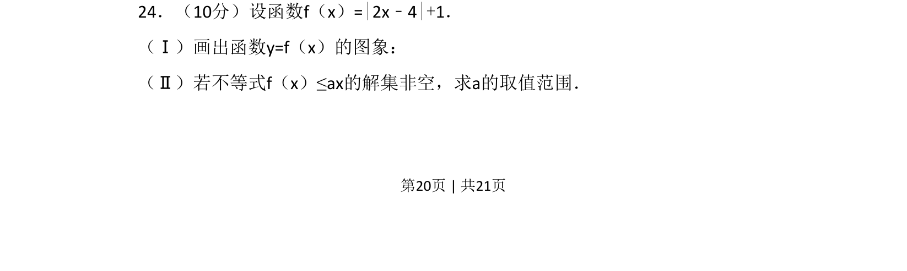
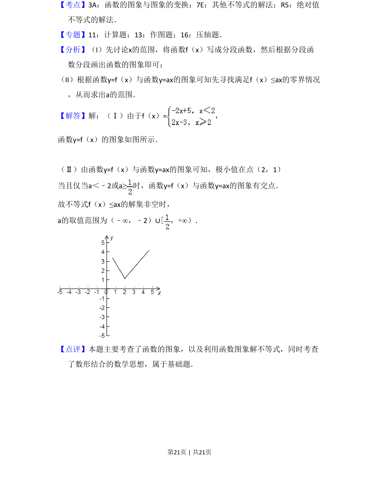

## 题面

## 摘要

本题考查绝对值函数的图象绘制及利用图象分析含参不等式解集非空问题。

## 关联考点

- [[585-绝对值函数|绝对值函数]]
- [[898-数形结合|数形结合]]
- [[726-参数范围|参数范围]]

## 答案与解析

> 📄 原 PDF 第 20 页：`素材/真题/吉林/2008-2024·（吉林）数学高考真题/2010年高考数学试卷（理）（新课标）（解析卷）.pdf`
