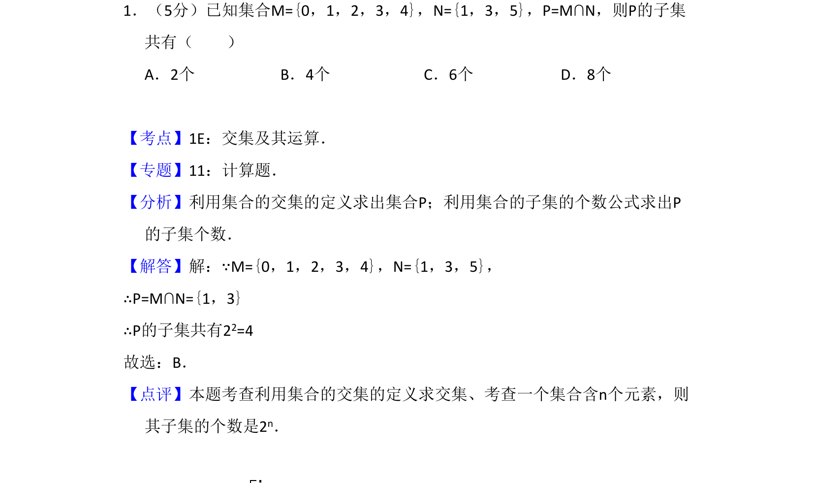
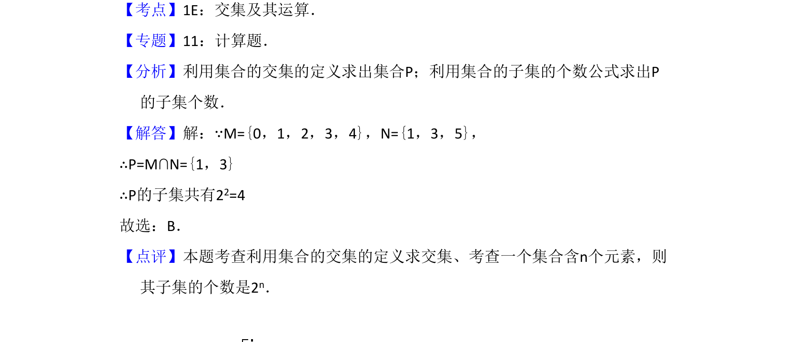

## 题面

## 摘要

求集合交集与子集个数

## 关联考点

- [[1222-交集|交集]]
- [[1221-子集个数|子集个数]]

## 答案与解析

> 📄 原 PDF 第 1 页：`素材/真题/吉林/2008-2024·（吉林）数学高考真题/2011年高考数学试卷（文）（新课标）（解析卷）.pdf`

<!-- 题干文本-start -->
## 题干文本
1．（5分）已知集合M={0，1，2，3，4}，N={1，3，5}，P=M∩N，则P的子集
共有（　　）
A．2个B．4个C．6个D．8个
<!-- 题干文本-end -->

<!-- 解析文本-start -->
## 解析文本
【考点】1E：交集及其运算．菁优网版权所有
【专题】11：计算题．
【分析】利用集合的交集的定义求出集合P；利用集合的子集的个数公式求出P
的子集个数．
【解答】解：∵M={0，1，2，3，4}，N={1，3，5}，
∴P=M∩N={1，3}
∴P的子集共有22=4
故选：B．
【点评】本题考查利用集合的交集的定义求交集、考查一个集合含n个元素，则
其子集的个数是2n．
<!-- 解析文本-end -->
