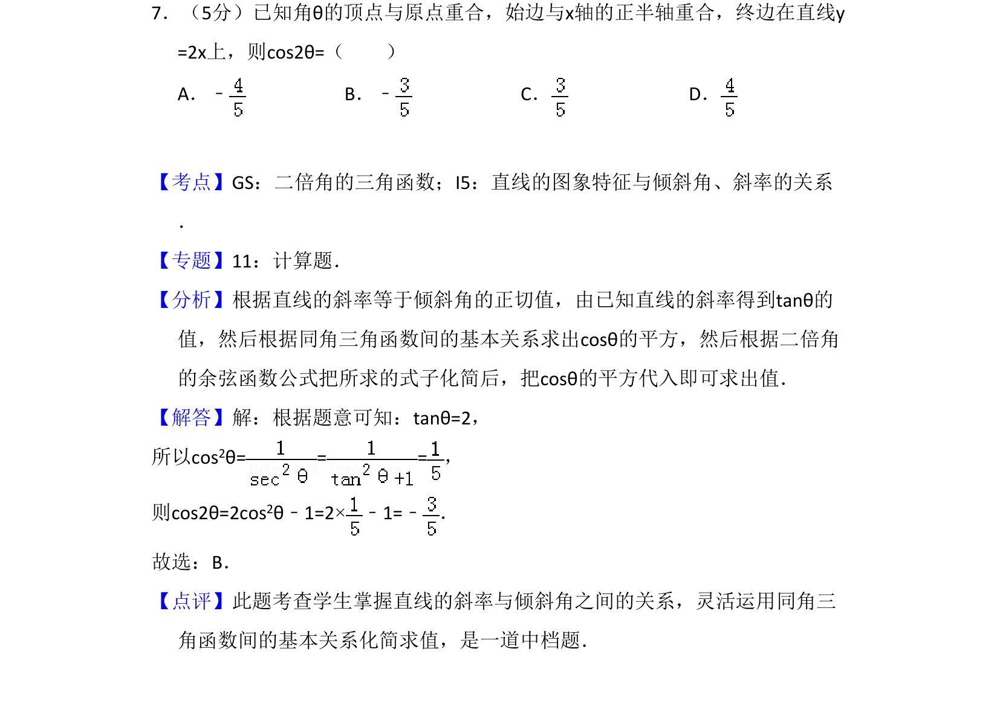
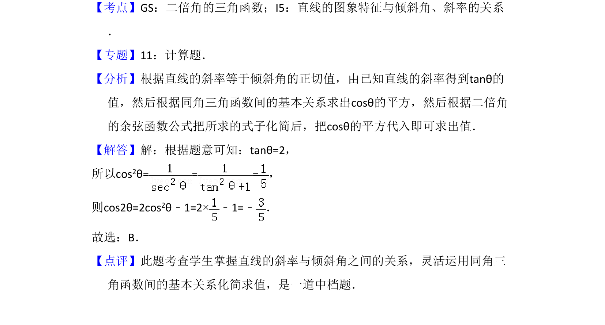

## 题面

## 摘要

根据直线的斜率与倾斜角关系，利用同角三角函数关系和二倍角公式求值。

## 关联考点

- [[638-二倍角的三角函数|二倍角的三角函数]]
- [[393-直线倾斜角与斜率|直线的倾斜角与斜率]]

## 答案与解析

> 📄 原 PDF 第 5 页：`素材/真题/吉林/2008-2024·（吉林）数学高考真题/2011年高考数学试卷（文）（新课标）（解析卷）.pdf`

<!-- 题干文本-start -->
## 题干文本
7．（5分）已知角θ的顶点与原点重合，始边与x轴的正半轴重合，终边在直线y
=2x上，则cos2θ=（　　）
A．﹣B．﹣C．D．
<!-- 题干文本-end -->

<!-- 解析文本-start -->
## 解析文本
【考点】GS：二倍角的三角函数；I5：直线的图象特征与倾斜角、斜率的关系
．菁优网版权所有
【专题】11：计算题．
【分析】根据直线的斜率等于倾斜角的正切值，由已知直线的斜率得到tanθ的
值，然后根据同角三角函数间的基本关系求出cosθ的平方，然后根据二倍角
的余弦函数公式把所求的式子化简后，把cosθ的平方代入即可求出值．
【解答】解：根据题意可知：tanθ=2，
所以cos2θ== =，
则cos2θ=2cos2θ﹣1=2×﹣1=﹣ ．
故选：B．
【点评】此题考查学生掌握直线的斜率与倾斜角之间的关系，灵活运用同角三
角函数间的基本关系化简求值，是一道中档题．
<!-- 解析文本-end -->
