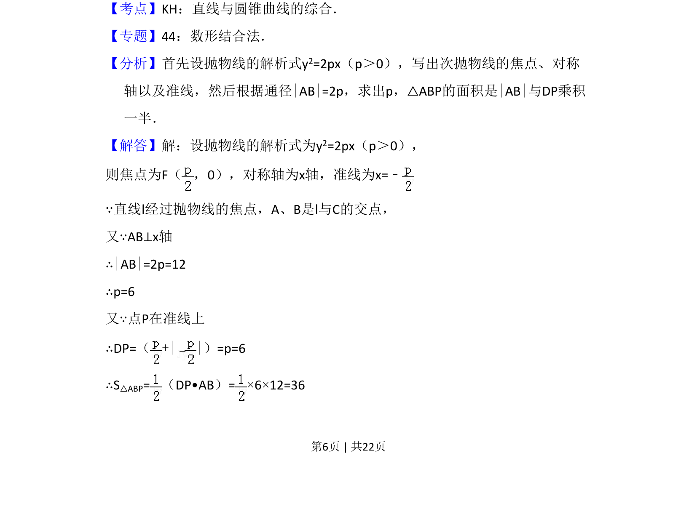
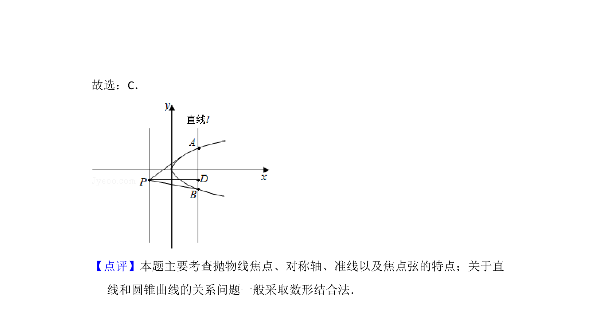

## 题面

## 摘要

本题通过抛物线的几何性质求三角形面积，涉及焦点、准线及通径长度。

## 关联考点

- [[227-抛物线|抛物线]]
- [[037-焦点焦距|焦点]]
- [[准线]]
- [[通径]]
- [[062-多边形面积|三角形面积]]

## 答案与解析

> 📄 原 PDF 第 6 页：`素材/真题/吉林/2008-2024·（吉林）数学高考真题/2011年高考数学试卷（文）（新课标）（解析卷）.pdf`
