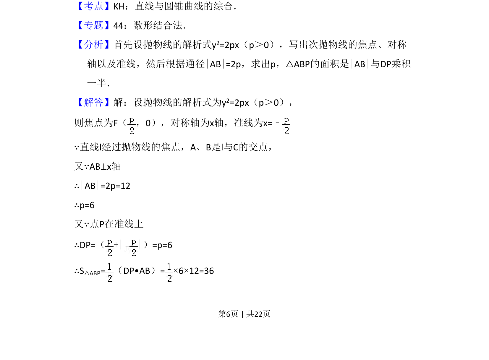
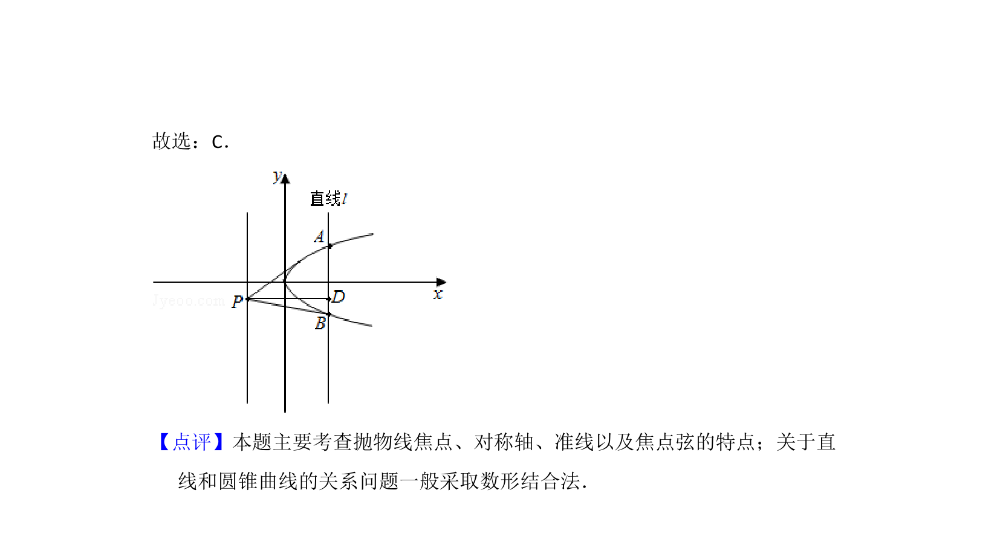

## 题面

## 摘要

本题通过抛物线的几何性质求三角形面积，涉及焦点、准线及通径长度。

## 关联考点

- [[227-抛物线|抛物线]]
- [[037-焦点焦距|焦点]]
- [[1165-准线|准线]]
- [[1169-通径|通径]]
- [[062-多边形面积|三角形面积]]

## 答案与解析

> 📄 原 PDF 第 6 页：`素材/真题/吉林/2008-2024·（吉林）数学高考真题/2011年高考数学试卷（文）（新课标）（解析卷）.pdf`

<!-- 题干文本-start -->
## 题干文本
9．（5分）已知直线l过抛物线C的焦点，且与C的对称轴垂直．l与C交于A，B两
点，|AB|=12，P为C的准线上一点，则△ABP的面积为（　　）
A．18 B．24 C．36 D．48
<!-- 题干文本-end -->

<!-- 解析文本-start -->
## 解析文本
【考点】KH：直线与圆锥曲线的综合．菁优网版权所有
【专题】44：数形结合法．
【分析】首先设抛物线的解析式y2=2px（p＞0），写出次抛物线的焦点、对称
轴以及准线，然后根据通径|AB|=2p，求出p，△ABP的面积是|AB|与DP乘积
一半．
【解答】解：设抛物线的解析式为y2=2px（p＞0），
则焦点为F（ ，0），对称轴为x轴，准线为x=﹣
∵直线l经过抛物线的焦点，A、B是l与C的交点，
又∵AB⊥x轴
∴|AB|=2p=12
∴p=6
又∵点P在准线上
∴DP=（+| |）=p=6
∴S△ABP=（DP•AB）=×6×12=36
<!-- 解析文本-end -->
