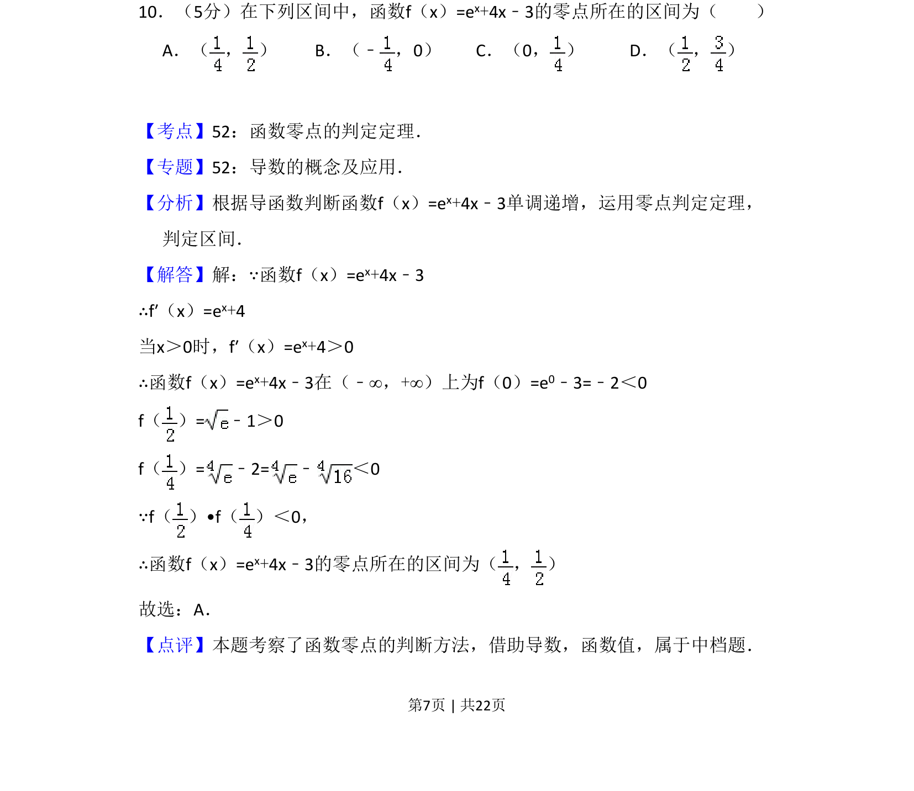
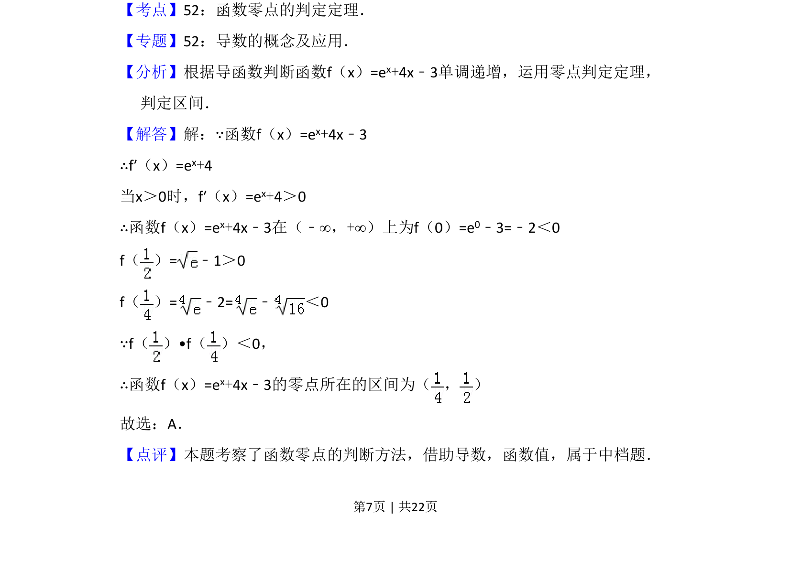

## 题面

## 摘要

考察利用导数判断函数单调性及零点存在定理确定零点所在区间。

## 关联考点

- [[695-函数零点的判定定理|函数零点的判定定理]]
- [[705-利用导数研究函数的单调性|导数与单调性]]

## 答案与解析

> 📄 原 PDF 第 7 页：`素材/真题/吉林/2008-2024·（吉林）数学高考真题/2011年高考数学试卷（文）（新课标）（解析卷）.pdf`
