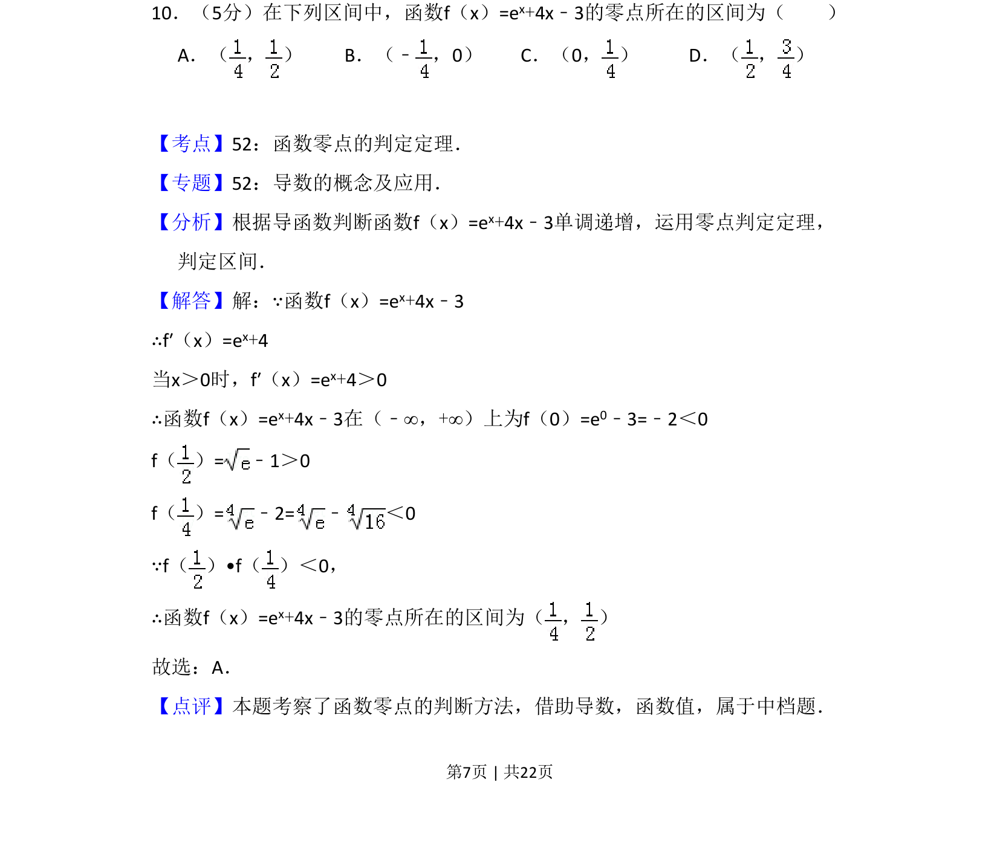
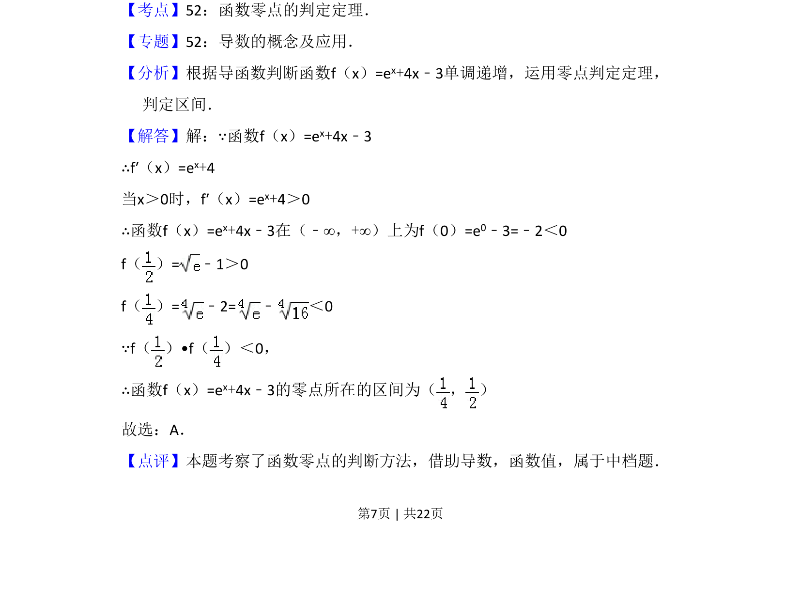

## 题面

## 摘要

考察利用导数判断函数单调性及零点存在定理确定零点所在区间。

## 关联考点

- [[695-函数零点的判定定理|函数零点的判定定理]]
- [[705-利用导数研究函数的单调性|导数与单调性]]

## 答案与解析

> 📄 原 PDF 第 7 页：`素材/真题/吉林/2008-2024·（吉林）数学高考真题/2011年高考数学试卷（文）（新课标）（解析卷）.pdf`

<!-- 题干文本-start -->
## 题干文本
10．（5分）在下列区间中，函数f（x）=ex+4x﹣3的零点所在的区间为（　　）
A．（ ， ）B．（﹣ ，0）C．（0， ）D．（ ， ）
<!-- 题干文本-end -->

<!-- 解析文本-start -->
## 解析文本
【考点】52：函数零点的判定定理．菁优网版权所有
【专题】52：导数的概念及应用．
【分析】根据导函数判断函数f（x）=ex+4x﹣3单调递增，运用零点判定定理，
判定区间．
【解答】解：∵函数f（x）=ex+4x﹣3
∴f′（x）=ex+4
当x＞0时，f′（x）=ex+4＞0
∴函数f（x）=ex+4x﹣3在（﹣∞，+∞）上为f（0）=e0﹣3=﹣2＜0
f（ ）=﹣1＞0
f（ ）=﹣2=﹣ ＜0
∵f（ ）•f（ ）＜0，
∴函数f（x）=ex+4x﹣3的零点所在的区间为（ ， ）
故选：A．
【点评】本题考察了函数零点的判断方法，借助导数，函数值，属于中档题．
<!-- 解析文本-end -->
