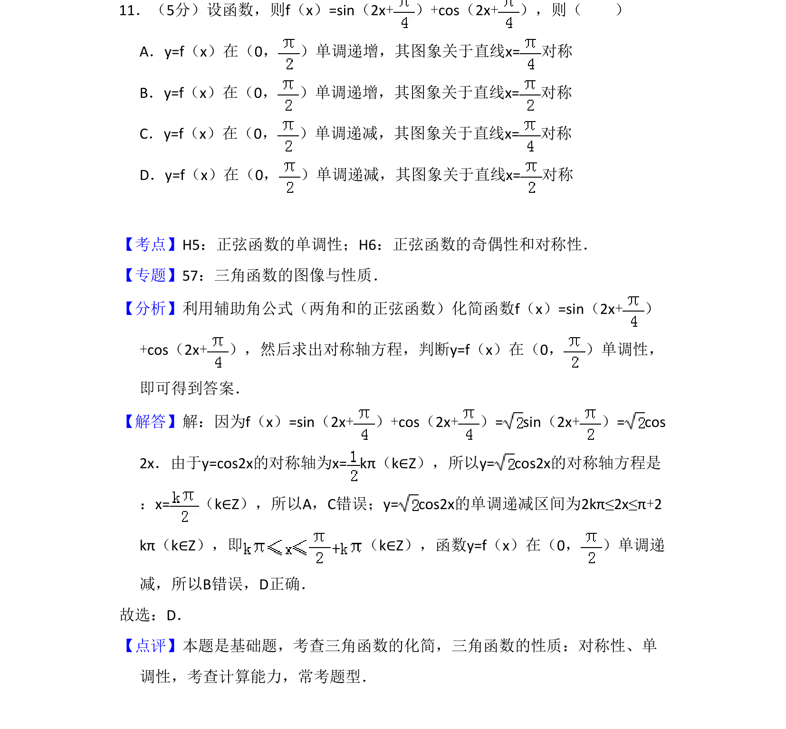
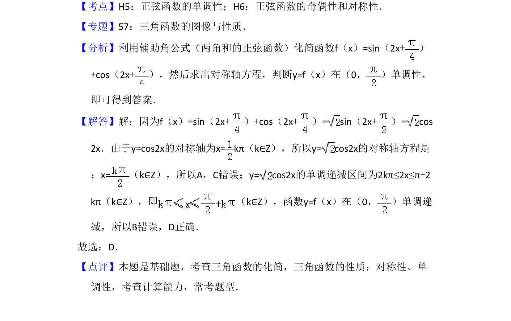

## 题面

## 摘要

本题主要考查利用辅助角公式化简三角函数，并判断其对称性与单调性。

## 关联考点

- [[1126-辅助角公式|辅助角公式]]
- [[567-正弦函数的对称性|正弦函数的对称性]]
- [[961-正弦函数的单调性|正弦函数的单调性]]

## 答案与解析

> 📄 原 PDF 第 8 页：`素材/真题/吉林/2008-2024·（吉林）数学高考真题/2011年高考数学试卷（文）（新课标）（解析卷）.pdf`

<!-- 题干文本-start -->
## 题干文本
11．（5分）设函数，则f（x）=sin（2x+）+cos（2x+），则（　　）
A．y=f（x）在（0， ）单调递增，其图象关于直线x=对称
B．y=f（x）在（0， ）单调递增，其图象关于直线x=对称
C．y=f（x）在（0， ）单调递减，其图象关于直线x=对称
D．y=f（x）在（0， ）单调递减，其图象关于直线x=对称
<!-- 题干文本-end -->

<!-- 解析文本-start -->
## 解析文本
【考点】H5：正弦函数的单调性；H6：正弦函数的奇偶性和对称性．菁优网版权所有
【专题】57：三角函数的图像与性质．
【分析】利用辅助角公式（两角和的正弦函数）化简函数f（x）=sin（2x+）
+cos（2x+），然后求出对称轴方程，判断y=f（x）在（0， ）单调性，
即可得到答案．
【解答】解：因为f（x）=sin（2x+）+cos（2x+）= sin（2x+）= cos
2x．由于y=cos2x的对称轴为x=kπ（k∈Z），所以y= cos2x的对称轴方程是
：x=（k∈Z），所以A，C错误；y= cos2x的单调递减区间为2kπ≤2x≤π+2
kπ（k∈Z），即 （k∈Z），函数y=f（x）在（0， ）单调递
减，所以B错误，D正确．
故选：D．
【点评】本题是基础题，考查三角函数的化简，三角函数的性质：对称性、单
调性，考查计算能力，常考题型．
<!-- 解析文本-end -->
