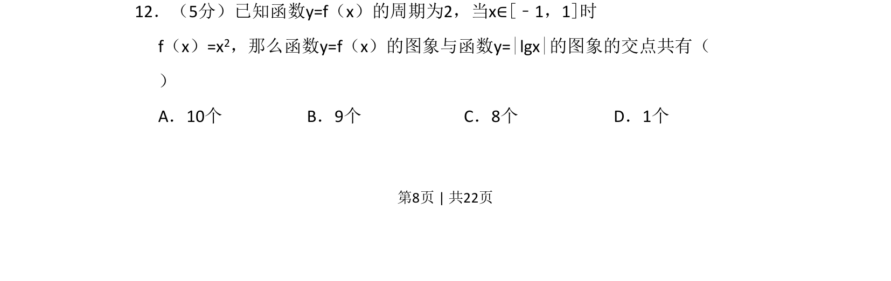

## 题面

## 摘要

周期函数与绝对值对数函数图象交点个数问题，结合二次函数和对数函数性质分析。

## 关联考点

- [[函数的周期性]]
- [[212-二次函数定义|二次函数]]
- [[298-对数函数|对数函数]]
- [[图象交点]]

## 答案与解析

> 📄 原 PDF 第 8 页：`素材/真题/吉林/2008-2024·（吉林）数学高考真题/2011年高考数学试卷（文）（新课标）（解析卷）.pdf`
