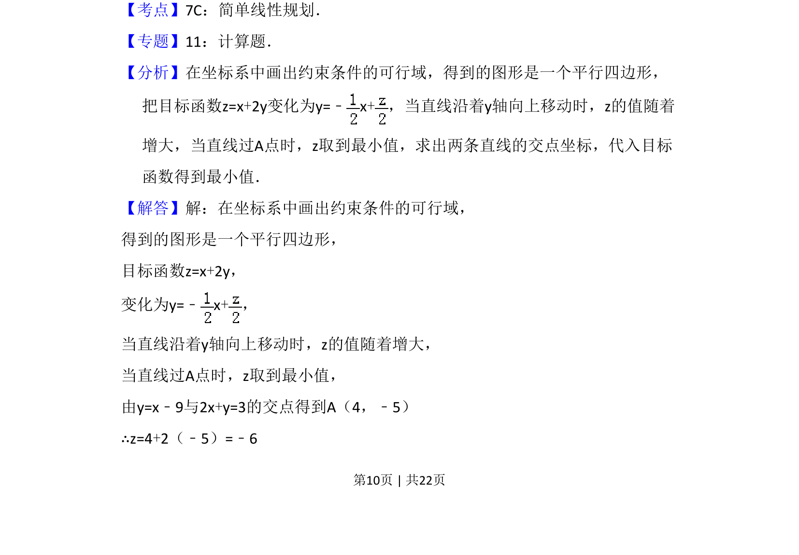
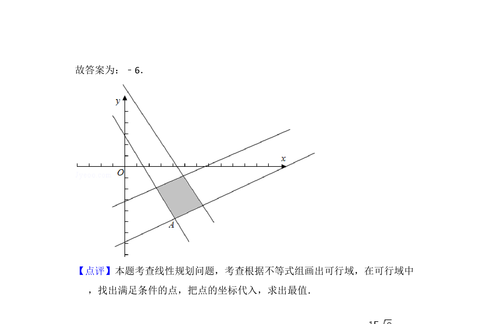

## 题面

## 摘要

本题为简单线性规划，已知线性约束条件，求目标函数的最小值。

## 关联考点

- [[1074-简单线性规划|简单线性规划]]
- [[1156-可行域|可行域]]
- [[999-目标函数|目标函数]]

## 答案与解析

> 📄 原 PDF 第 10 页：`素材/真题/吉林/2008-2024·（吉林）数学高考真题/2011年高考数学试卷（文）（新课标）（解析卷）.pdf`

<!-- 题干文本-start -->
## 题干文本
14．（5分）若变量x，y满足约束条件 ，则z=x+2y的最小值为　﹣6　
．
<!-- 题干文本-end -->

<!-- 解析文本-start -->
## 解析文本
【考点】7C：简单线性规划．菁优网版权所有
【专题】11：计算题．
【分析】在坐标系中画出约束条件的可行域，得到的图形是一个平行四边形，
把目标函数z=x+2y变化为y=﹣x+，当直线沿着y轴向上移动时，z的值随着
增大，当直线过A点时，z取到最小值，求出两条直线的交点坐标，代入目标
函数得到最小值．
【解答】解：在坐标系中画出约束条件的可行域，
得到的图形是一个平行四边形，
目标函数z=x+2y，
变化为y=﹣x+，
当直线沿着y轴向上移动时，z的值随着增大，
当直线过A点时，z取到最小值，
由y=x﹣9与2x+y=3的交点得到A（4，﹣5）
∴z=4+2（﹣5）=﹣6
<!-- 解析文本-end -->
