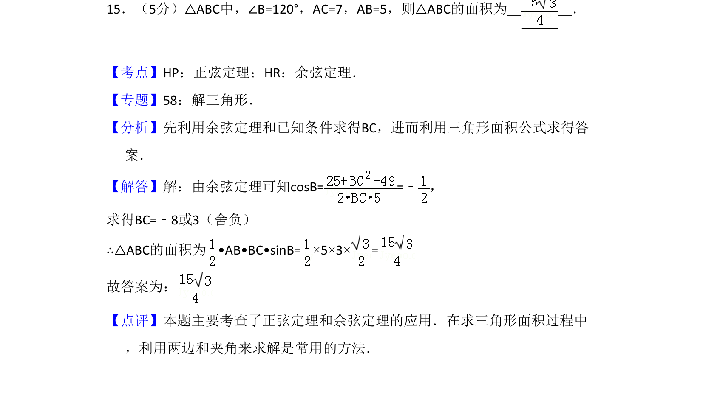
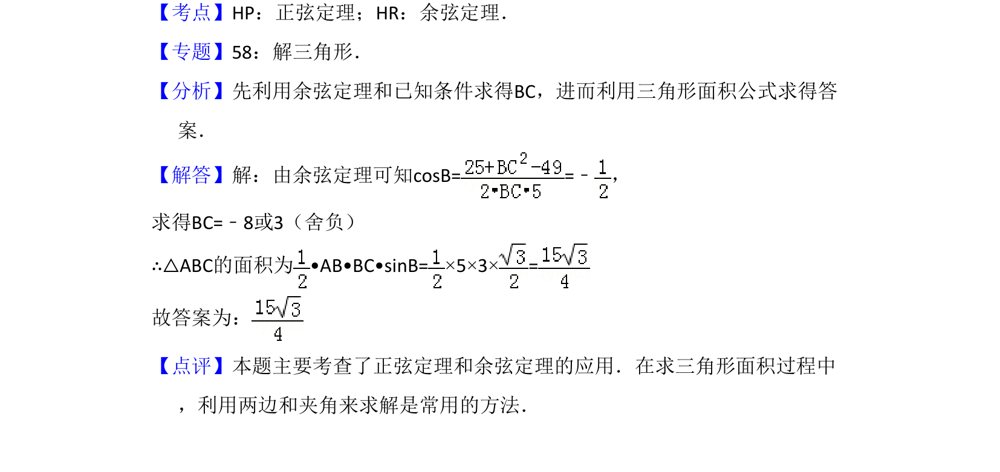

## 题面

## 摘要

利用余弦定理求边长，再用两边夹角面积公式计算三角形面积。

## 关联考点

- [[126-定理|正弦定理]]
- [[126-定理|余弦定理]]

## 答案与解析

> 📄 原 PDF 第 11 页：`素材/真题/吉林/2008-2024·（吉林）数学高考真题/2011年高考数学试卷（文）（新课标）（解析卷）.pdf`

<!-- 题干文本-start -->
## 题干文本
15．（5分）△ABC中，∠B=120°，AC=7，AB=5，则△ABC的面积为　 　．
<!-- 题干文本-end -->

<!-- 解析文本-start -->
## 解析文本
【考点】HP：正弦定理；HR：余弦定理．菁优网版权所有
【专题】58：解三角形．
【分析】先利用余弦定理和已知条件求得BC，进而利用三角形面积公式求得答
案．
【解答】解：由余弦定理可知cosB= =﹣ ，
求得BC=﹣8或3（舍负）
∴△ABC的面积为•AB•BC•sinB=×5×3×=
故答案为：
【点评】本题主要考查了正弦定理和余弦定理的应用．在求三角形面积过程中
，利用两边和夹角来求解是常用的方法．
<!-- 解析文本-end -->
