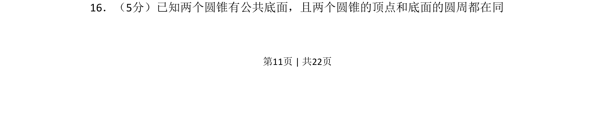
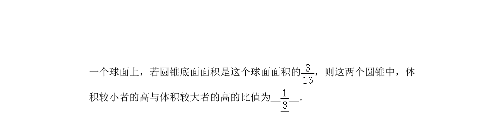
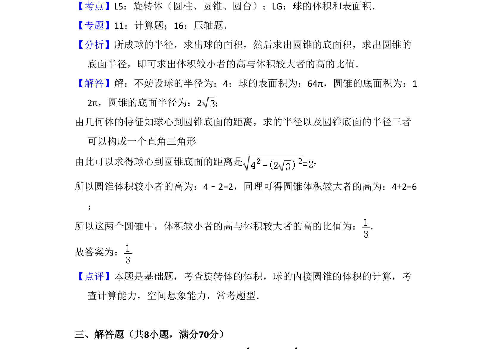

## 题面

## 摘要

两个共底面圆锥内接于同一球，考查球与圆锥的几何关系及相关计算

## 关联考点

- [[079-圆锥|圆锥]]
- [[021-球|球]]
- [[661-内接几何体|内接几何体]]

## 答案与解析

> 📄 原 PDF 第 11 页：`素材/真题/吉林/2008-2024·（吉林）数学高考真题/2011年高考数学试卷（文）（新课标）（解析卷）.pdf`
