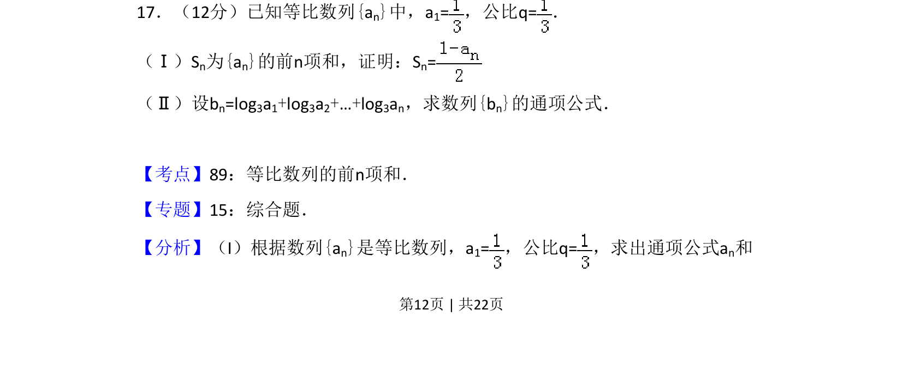
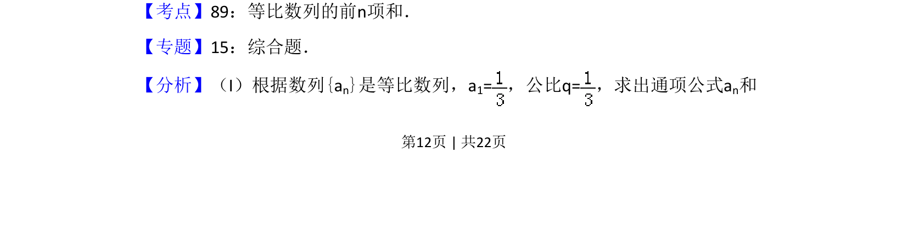
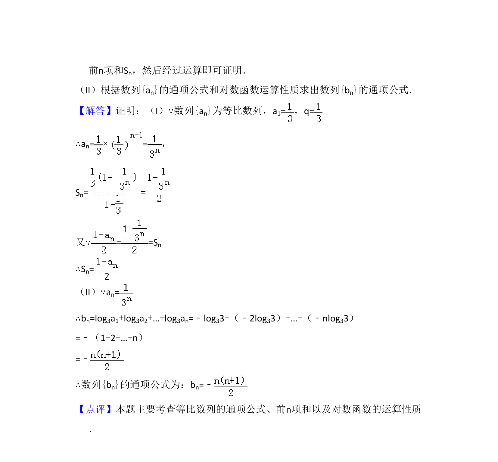

## 题面

## 摘要

考查等比数列前n项和公式的应用及对数运算求通项。

## 关联考点

- [[358-等比数列概念|等比数列]]
- [[355-等差数列前n项和|前n项和]]
- [[对数运算]]
- [[384-数列通项公式|通项公式]]

## 答案与解析

> 📄 原 PDF 第 12 页：`素材/真题/吉林/2008-2024·（吉林）数学高考真题/2011年高考数学试卷（文）（新课标）（解析卷）.pdf`
