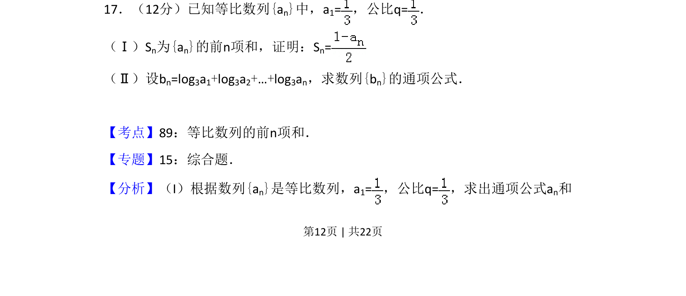
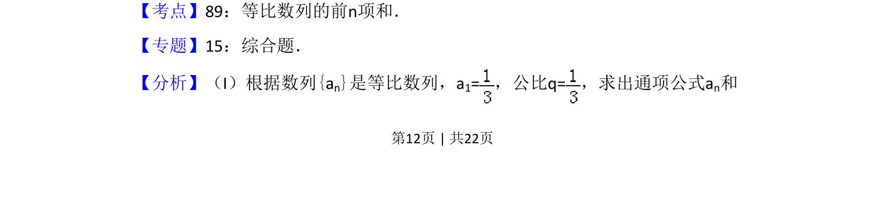
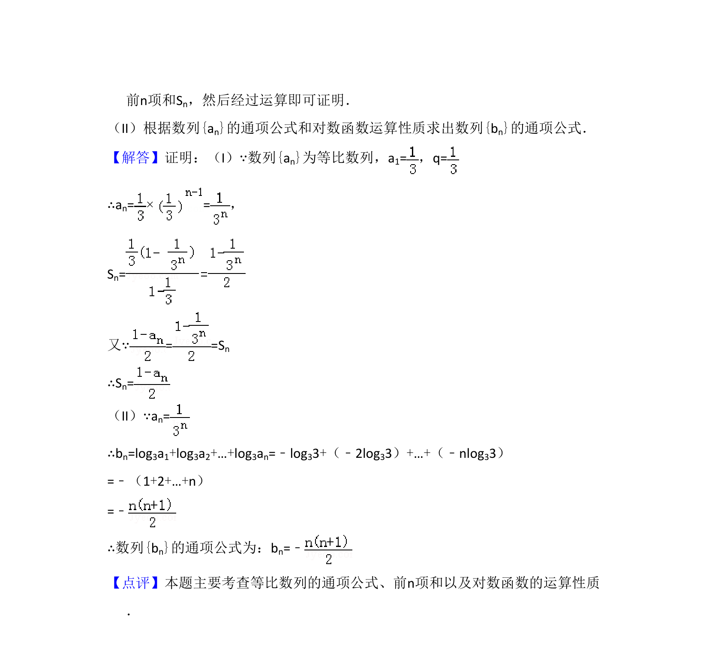

## 题面

## 摘要

考查等比数列前n项和公式的应用及对数运算求通项。

## 关联考点

- [[358-等比数列概念|等比数列]]
- [[355-等差数列前n项和|前n项和]]
- [[832-对数运算|对数运算]]
- [[384-数列通项公式|通项公式]]

## 答案与解析

> 📄 原 PDF 第 12 页：`素材/真题/吉林/2008-2024·（吉林）数学高考真题/2011年高考数学试卷（文）（新课标）（解析卷）.pdf`

<!-- 题干文本-start -->
## 题干文本
17．（12分）已知等比数列{an}中，a1=，公比q=．
（Ⅰ）Sn为{an}的前n项和，证明：Sn=
（Ⅱ）设bn=log3a1+log3a2+…+log3an，求数列{bn}的通项公式．
<!-- 题干文本-end -->

<!-- 解析文本-start -->
## 解析文本
【考点】89：等比数列的前n项和．菁优网版权所有
【专题】15：综合题．
【分析】（I）根据数列{an}是等比数列，a1=，公比q=，求出通项公式a n和
<!-- 解析文本-end -->
