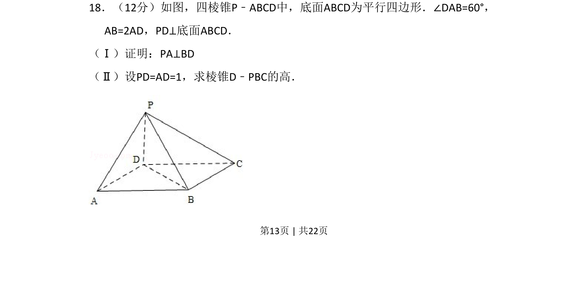
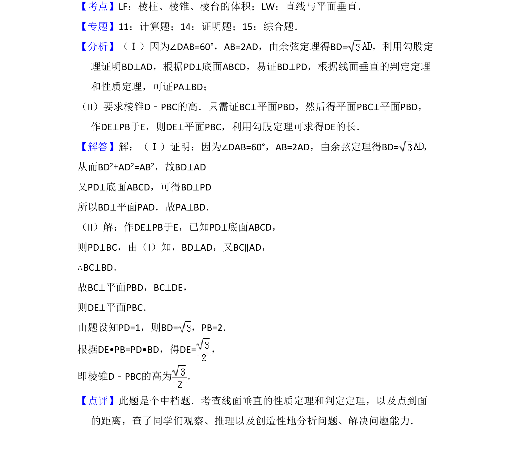

## 题面

## 摘要

立体几何中，通过线面垂直证明异面直线垂直，并利用等体积法求点到平面的距离。

## 关联考点

- [[351-空间直线平面垂直|线面垂直]]
- [[598-三垂线定理|三垂线定理]]
- [[1057-等体积法|等体积法]]
- [[978-点到平面距离|点到平面距离]]

## 答案与解析

> 📄 原 PDF 第 13 页：`素材/真题/吉林/2008-2024·（吉林）数学高考真题/2011年高考数学试卷（文）（新课标）（解析卷）.pdf`
