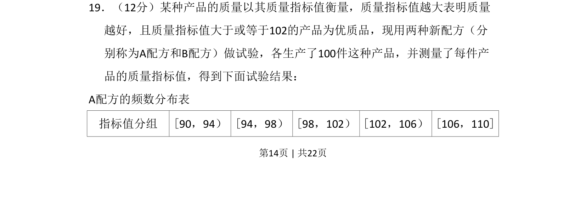
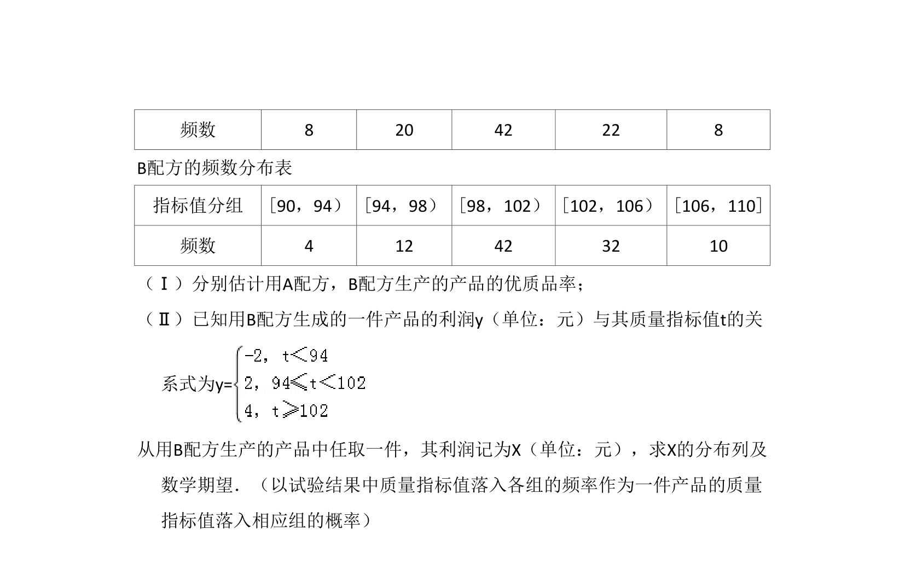
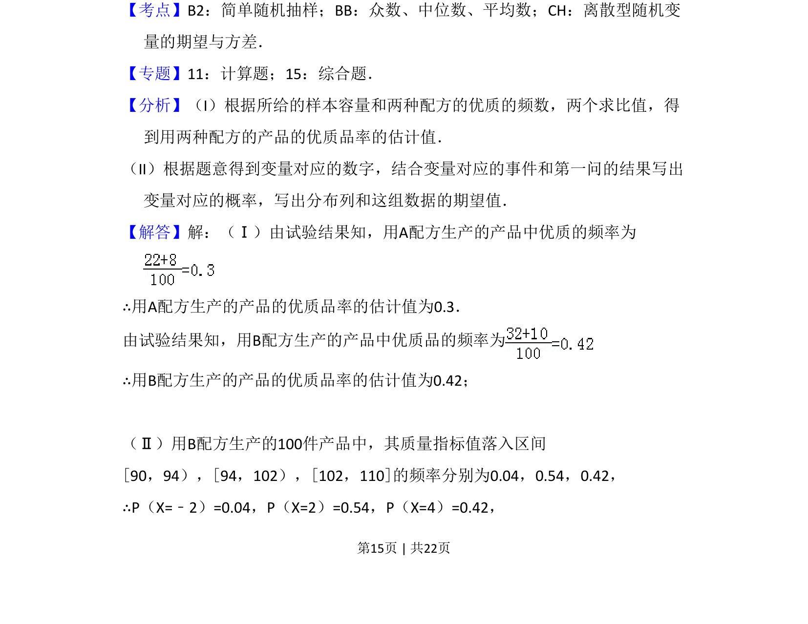
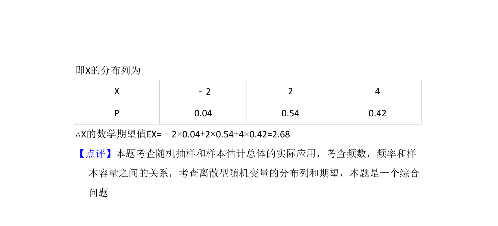

## 题面

## 摘要

本题通过A、B配方的频数分布表，考查统计量的计算与比较。

## 关联考点

- [[1153-频率分布表|频率分布表]]
- [[914-期望|期望]]
- [[945-概率|概率]]
- [[508-统计推断|统计推断]]

## 答案与解析

> 📄 原 PDF 第 14 页：`素材/真题/吉林/2008-2024·（吉林）数学高考真题/2011年高考数学试卷（文）（新课标）（解析卷）.pdf`

<!-- 题干文本-start -->
## 题干文本
19．（12分）某种产品的质量以其质量指标值衡量，质量指标值越大表明质量
越好，且质量指标值大于或等于102的产品为优质品，现用两种新配方（分
别称为A配方和B配方）做试验，各生产了100件这种产品，并测量了每件产
品的质量指标值，得到下面试验结果：
A配方的频数分布表
指标值分组 [90，94） [94，98） [98，102） [102，106） [106，110]
<!-- 题干文本-end -->

<!-- 解析文本-start -->
## 解析文本

<!-- 解析文本-end -->
