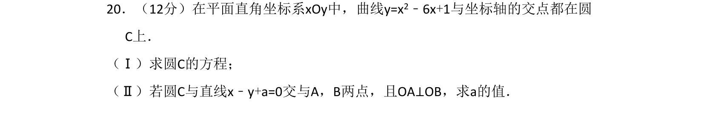
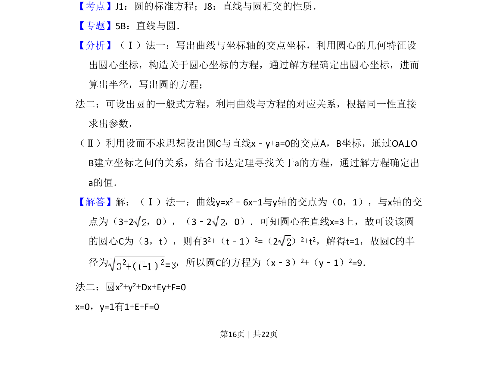
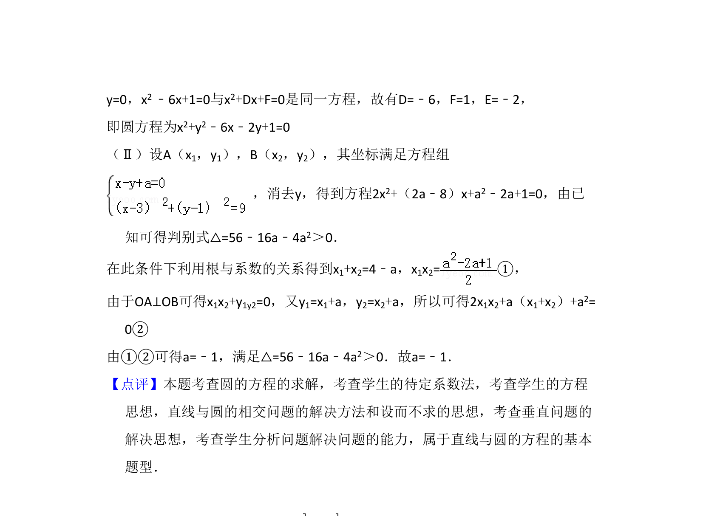

## 题面

## 摘要

求曲线与坐标轴交点确定的圆的方程，并由直线与圆相交且垂直条件求参数

## 关联考点

- [[373-圆的标准方程|圆的标准方程]]
- [[1004-直线与圆相交的性质|直线与圆相交的性质]]
- [[234-韦达定理-初中|韦达定理]]

## 答案与解析

> 📄 原 PDF 第 16 页：`素材/真题/吉林/2008-2024·（吉林）数学高考真题/2011年高考数学试卷（文）（新课标）（解析卷）.pdf`
