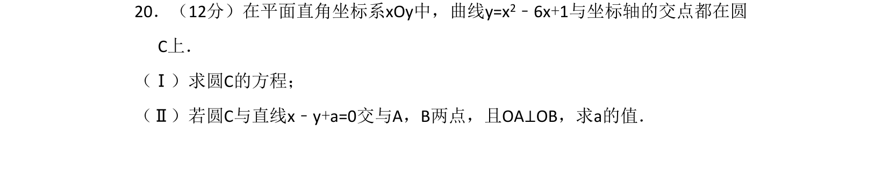
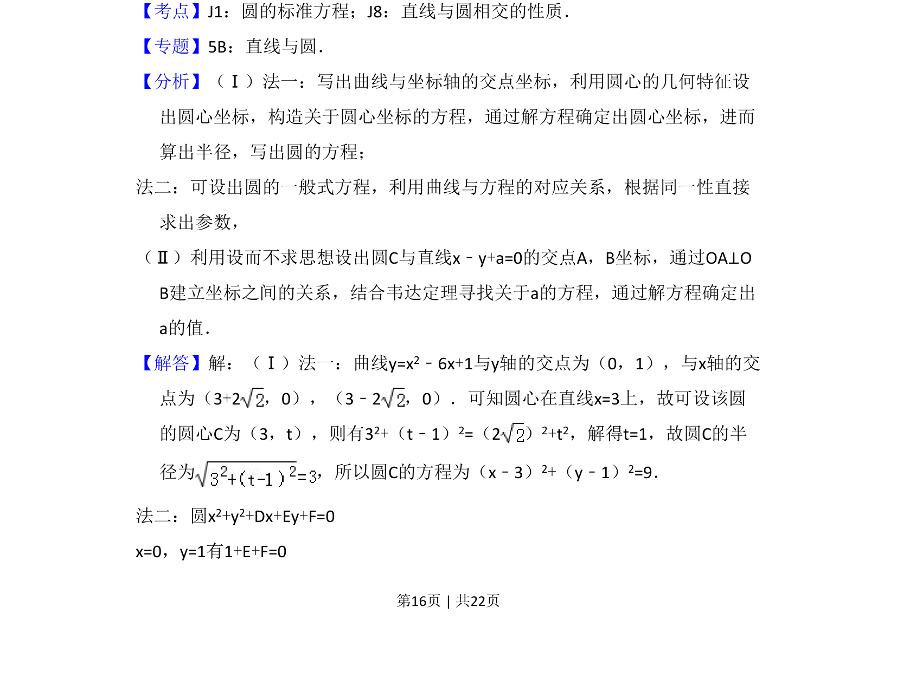
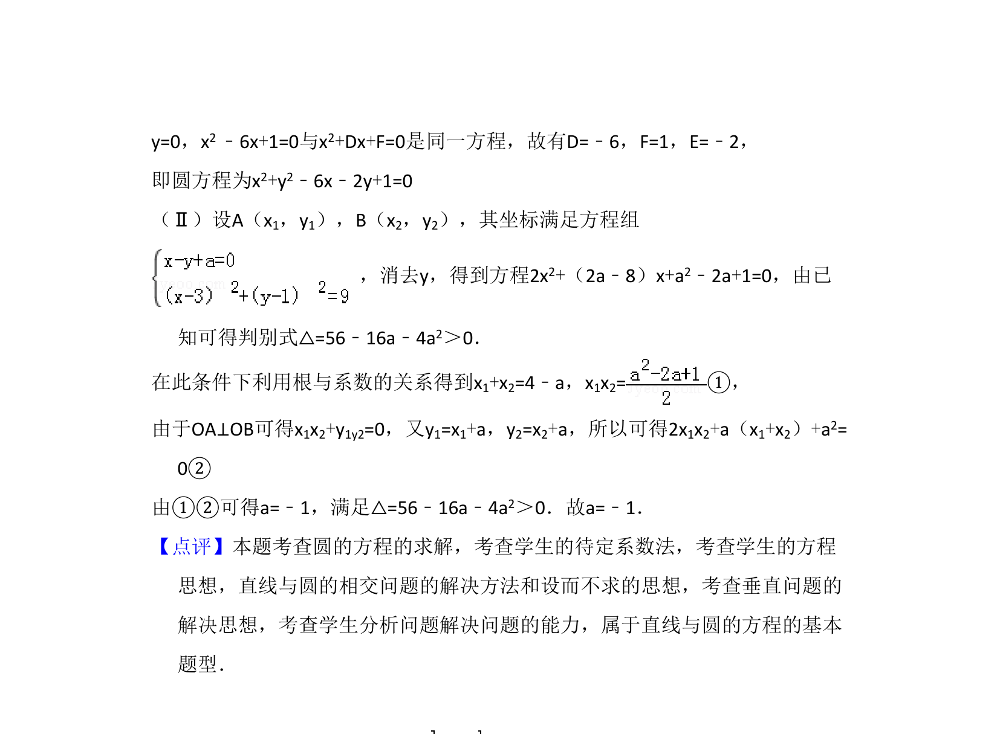

## 题面

## 摘要

求曲线与坐标轴交点确定的圆的方程，并由直线与圆相交且垂直条件求参数

## 关联考点

- [[373-圆的标准方程|圆的标准方程]]
- [[1003-直线与圆相交的性质|直线与圆相交的性质]]
- [[234-韦达定理-初中|韦达定理]]

## 答案与解析

> 📄 原 PDF 第 16 页：`素材/真题/吉林/2008-2024·（吉林）数学高考真题/2011年高考数学试卷（文）（新课标）（解析卷）.pdf`

<!-- 题干文本-start -->
## 题干文本
20．（12分）在平面直角坐标系xOy中，曲线y=x2﹣6x+1与坐标轴的交点都在圆
C上．
（Ⅰ）求圆C的方程；
（Ⅱ）若圆C与直线x﹣y+a=0交与A，B两点，且OA⊥OB，求a的值．
<!-- 题干文本-end -->

<!-- 解析文本-start -->
## 解析文本
【考点】J1：圆的标准方程；J8：直线与圆相交的性质．菁优网版权所有
【专题】5B：直线与圆．
【分析】（Ⅰ）法一：写出曲线与坐标轴的交点坐标，利用圆心的几何特征设
出圆心坐标，构造关于圆心坐标的方程，通过解方程确定出圆心坐标，进而
算出半径，写出圆的方程；
法二：可设出圆的一般式方程，利用曲线与方程的对应关系，根据同一性直接
求出参数，
（Ⅱ）利用设而不求思想设出圆C与直线x﹣y+a=0的交点A，B坐标，通过OA⊥O
B建立坐标之间的关系，结合韦达定理寻找关于a的方程，通过解方程确定出
a的值．
【解答】解：（Ⅰ）法一：曲线y=x2﹣6x+1与y轴的交点为（0，1），与x轴的交
点为（3+2，0），（3﹣2，0）．可知圆心在直线x=3上，故可设该圆
的圆心C为（3，t），则有32+（t﹣1）2=（2） 2+t2，解得t=1，故圆C的半
径为 ，所以圆C的方程为（x﹣3） 2+（y﹣1）2=9．
法二：圆x2+y2+Dx+Ey+F=0
x=0，y=1有1+E+F=0
<!-- 解析文本-end -->
