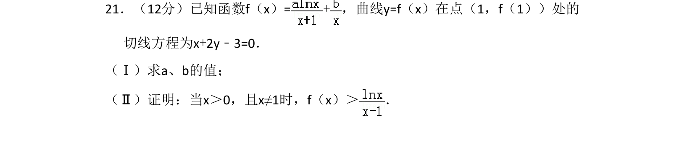
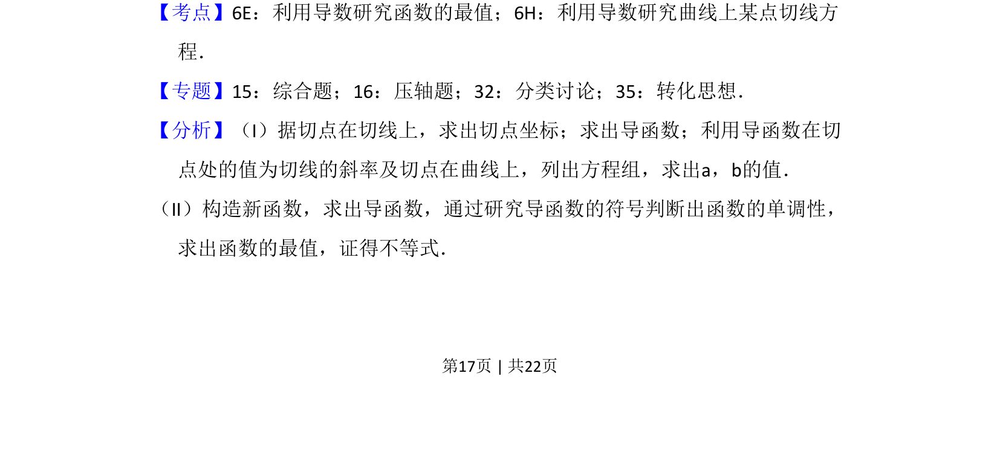
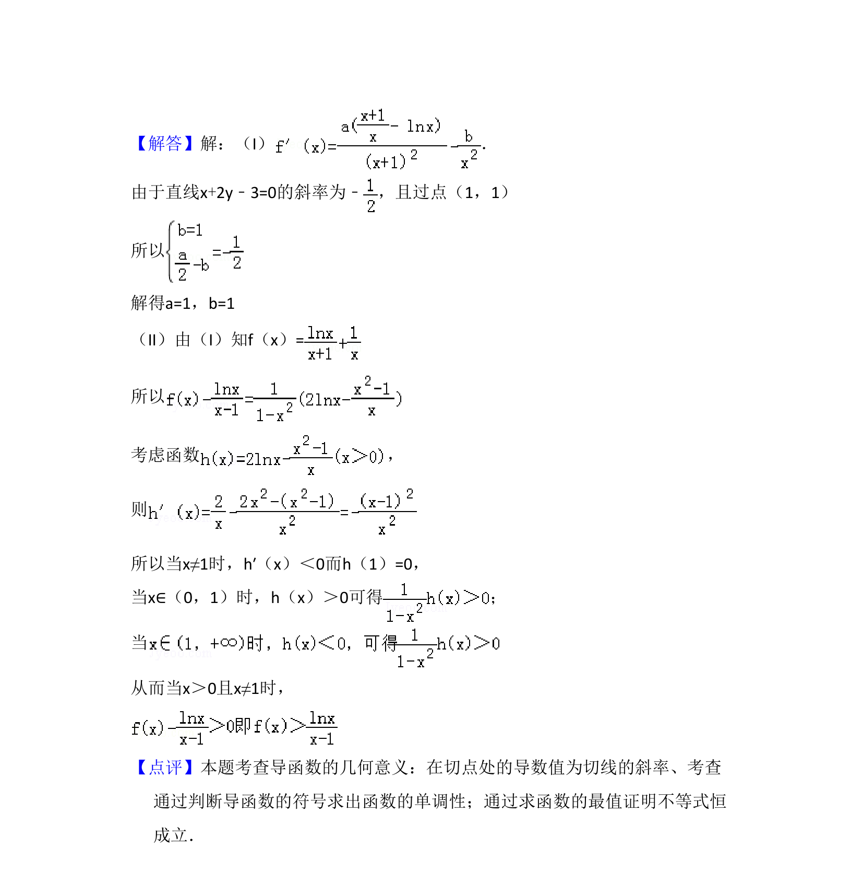

## 题面

## 摘要

已知函数在一点处的切线方程求参数，并利用导数证明不等式。

## 关联考点

- [[440-导数的几何意义|导数的几何意义]]
- [[706-利用导数研究函数的最值|利用导数研究函数的最值]]
- [[625-不等式证明|不等式证明]]

## 答案与解析

> 📄 原 PDF 第 17 页：`素材/真题/吉林/2008-2024·（吉林）数学高考真题/2011年高考数学试卷（文）（新课标）（解析卷）.pdf`
