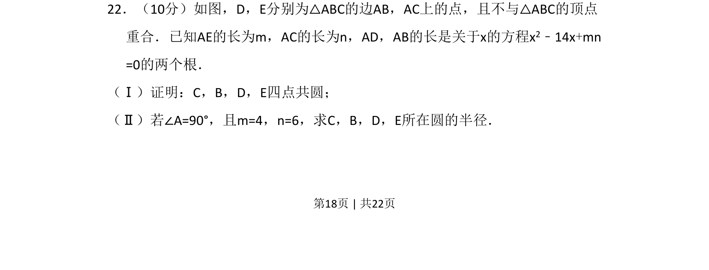
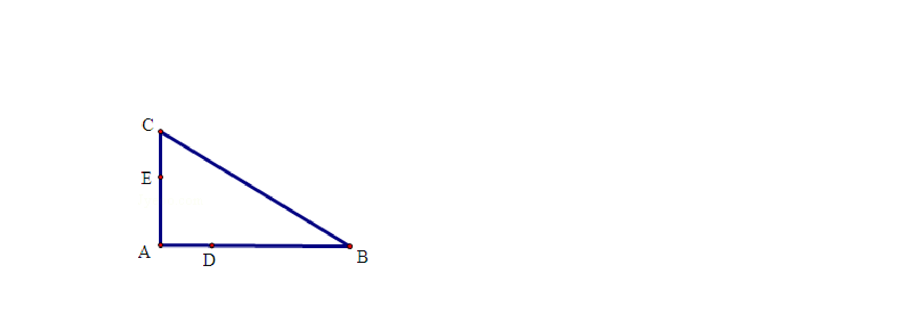
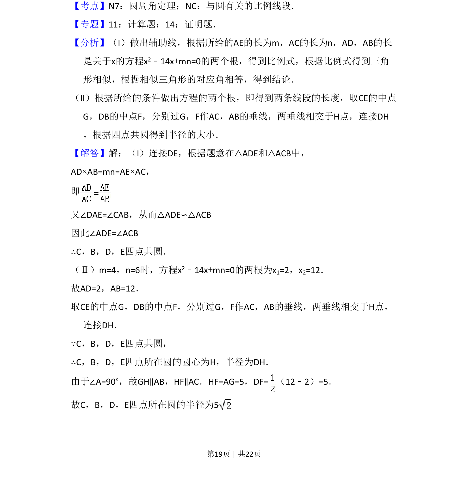
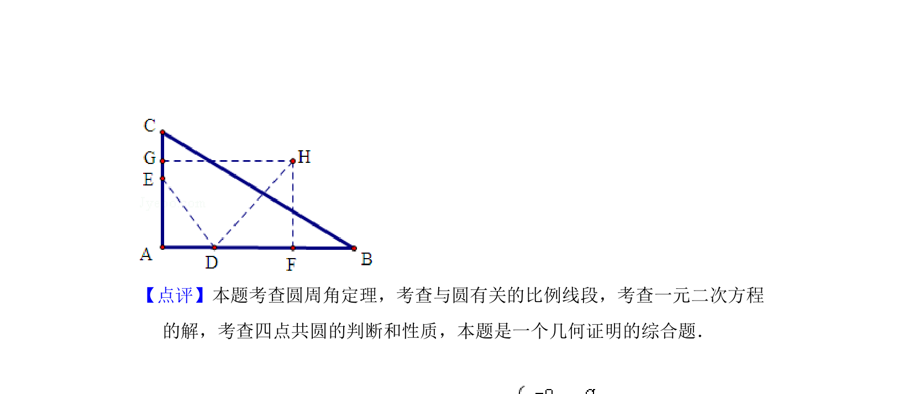

## 题面

## 摘要

本题主要考查四点共圆的判定与一元二次方程根与系数的关系，并结合直角三角形求圆的半径。

## 关联考点

- [[766-四点共圆|四点共圆]]
- [[564-根与系数的关系|根与系数的关系]]
- [[189-勾股定理|勾股定理]]
- [[780-圆的半径|圆的半径]]

## 答案与解析

> 📄 原 PDF 第 18 页：`素材/真题/吉林/2008-2024·（吉林）数学高考真题/2011年高考数学试卷（文）（新课标）（解析卷）.pdf`
