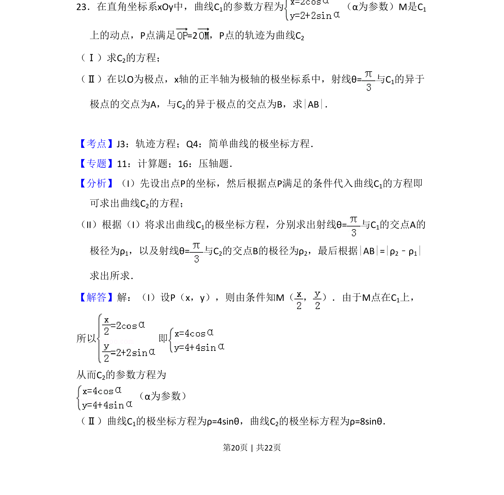

## 题面

## 摘要

该题考查参数方程与极坐标方程综合，由动点满足的向量关系求轨迹曲线，并在极坐标系下求两曲线交点的极径差。

## 关联考点

- [[376-圆锥曲线轨迹问题|轨迹方程]]
- [[简单曲线的极坐标方程]]

## 答案与解析

> 📄 原 PDF 第 20 页：`素材/真题/吉林/2008-2024·（吉林）数学高考真题/2011年高考数学试卷（文）（新课标）（解析卷）.pdf`
