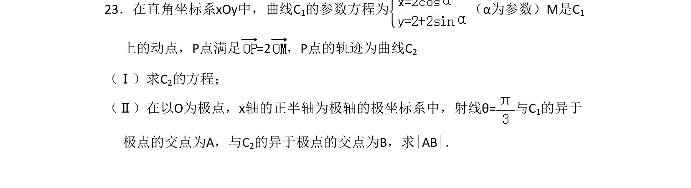
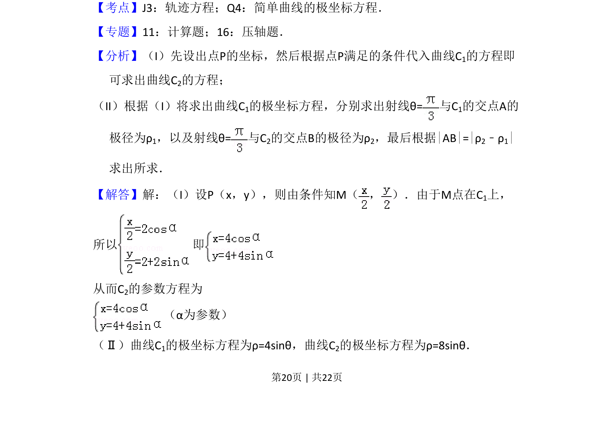
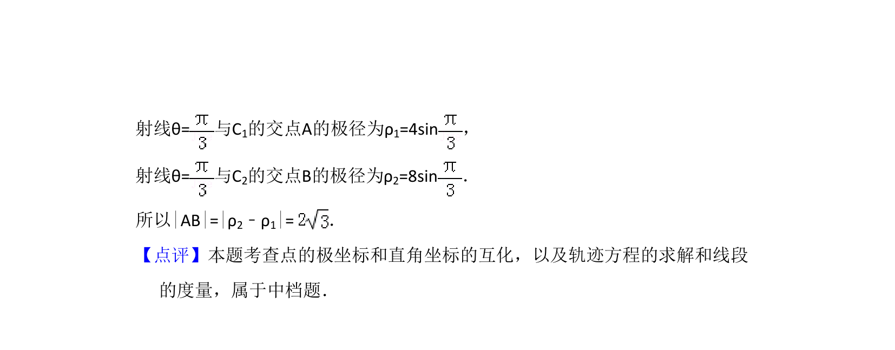

## 题面

## 摘要

该题考查参数方程与极坐标方程综合，由动点满足的向量关系求轨迹曲线，并在极坐标系下求两曲线交点的极径差。

## 关联考点

- [[376-圆锥曲线轨迹问题|轨迹方程]]
- [[1073-简单曲线的极坐标方程|简单曲线的极坐标方程]]

## 答案与解析

> 📄 原 PDF 第 20 页：`素材/真题/吉林/2008-2024·（吉林）数学高考真题/2011年高考数学试卷（文）（新课标）（解析卷）.pdf`

<!-- 题干文本-start -->
## 题干文本
23．在直角坐标系xOy中，曲线C1的参数方程为 （α为参数）M是C 1
上的动点，P点满足=2，P点的轨迹为曲线C 2
（Ⅰ）求C2的方程；
（Ⅱ）在以O为极点，x轴的正半轴为极轴的极坐标系中，射线θ=与C 1的异于
极点的交点为A，与C2的异于极点的交点为B，求|AB|．
<!-- 题干文本-end -->

<!-- 解析文本-start -->
## 解析文本
【考点】J3：轨迹方程；Q4：简单曲线的极坐标方程．菁优网版权所有
【专题】11：计算题；16：压轴题．
【分析】（I）先设出点P的坐标，然后根据点P满足的条件代入曲线C1的方程即
可求出曲线C2的方程；
（II）根据（I）将求出曲线C1的极坐标方程，分别求出射线θ=与C 1的交点A的
极径为ρ1，以及射线θ=与C 2的交点B的极径为ρ2，最后根据|AB|=|ρ2﹣ρ1|
求出所求．
【解答】解：（I）设P（x，y），则由条件知M（ ， ）．由于M点在C 1上，
所以 即
从而C2的参数方程为
（α为参数）
（Ⅱ）曲线C1的极坐标方程为ρ=4sinθ，曲线C2的极坐标方程为ρ=8sinθ．
<!-- 解析文本-end -->
