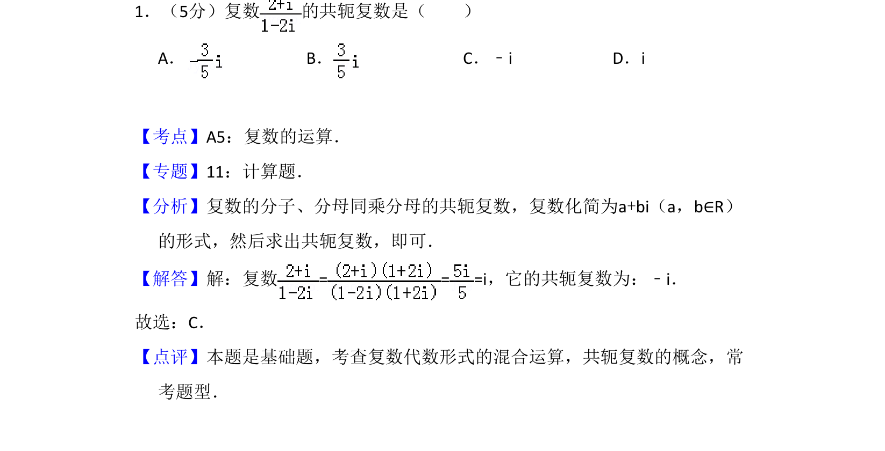
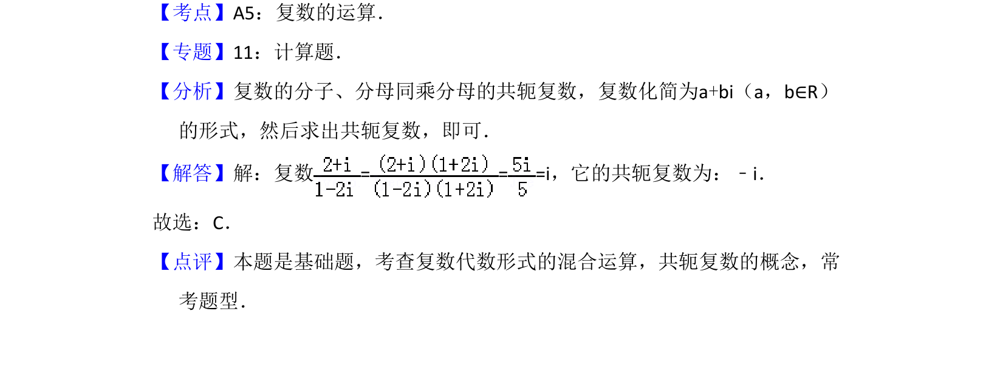

## 题面

## 摘要

复数除法运算及共轭复数概念的应用

## 关联考点

- [[811-复数运算|复数的运算]]
- [[534-共轭复数|共轭复数]]

## 答案与解析

> 📄 原 PDF 第 1 页：`素材/真题/吉林/2008-2024·（吉林）数学高考真题/2011年高考数学试卷（理）（新课标）（解析卷）.pdf`

<!-- 题干文本-start -->
## 题干文本
1．（5分）复数 的共轭复数是（　　）
A．B．C．﹣i D．i
<!-- 题干文本-end -->

<!-- 解析文本-start -->
## 解析文本
【考点】A5：复数的运算．菁优网版权所有
【专题】11：计算题．
【分析】复数的分子、分母同乘分母的共轭复数，复数化简为a+bi（a，b∈R）
的形式，然后求出共轭复数，即可．
【解答】解：复数= = =i，它的共轭复数为：﹣i．
故选：C．
【点评】本题是基础题，考查复数代数形式的混合运算，共轭复数的概念，常
考题型．
<!-- 解析文本-end -->
