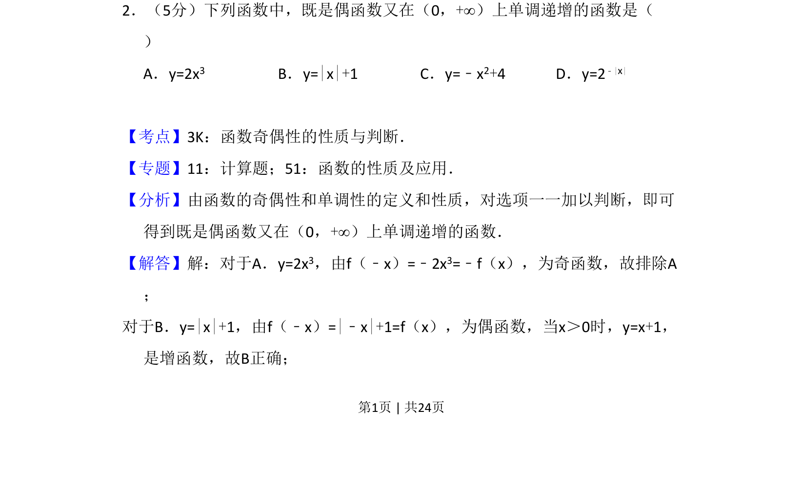
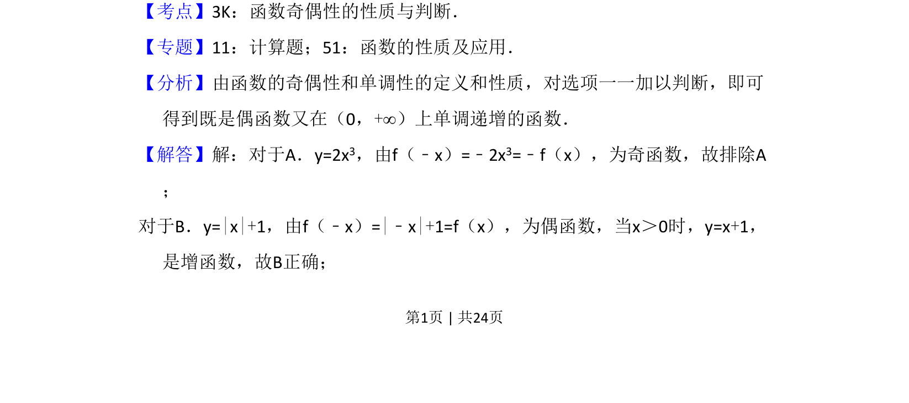
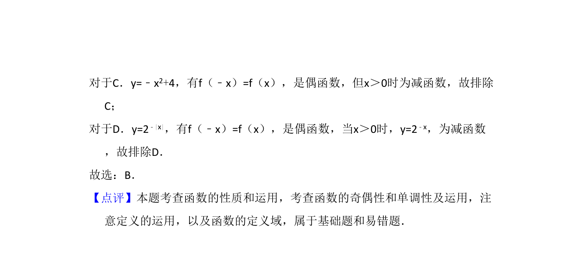

## 题面

## 摘要

本题考查函数奇偶性与单调性的判断，属于基础选择题。

## 关联考点

- [[284-函数的奇偶性|函数奇偶性]]
- [[432-导数与函数单调性|函数单调性]]

## 答案与解析

> 📄 原 PDF 第 1 页：`素材/真题/吉林/2008-2024·（吉林）数学高考真题/2011年高考数学试卷（理）（新课标）（解析卷）.pdf`

<!-- 题干文本-start -->
## 题干文本
2．（5分）下列函数中，既是偶函数又在（0，+∞）上单调递增的函数是（　　
）
A．y=2x3 B．y=|x|+1 C．y=﹣x 2+4 D．y=2 ﹣|x|
<!-- 题干文本-end -->

<!-- 解析文本-start -->
## 解析文本
【考点】3K：函数奇偶性的性质与判断．菁优网版权所有
【专题】11：计算题；51：函数的性质及应用．
【分析】由函数的奇偶性和单调性的定义和性质，对选项一一加以判断，即可
得到既是偶函数又在（0，+∞）上单调递增的函数．
【解答】解：对于A．y=2x3，由f（﹣x）=﹣2x3=﹣f（x），为奇函数，故排除A
；
对于B．y=|x|+1，由f（﹣x）=|﹣x|+1=f（x），为偶函数，当x＞0时，y=x+1，
是增函数，故B正确；
<!-- 解析文本-end -->
