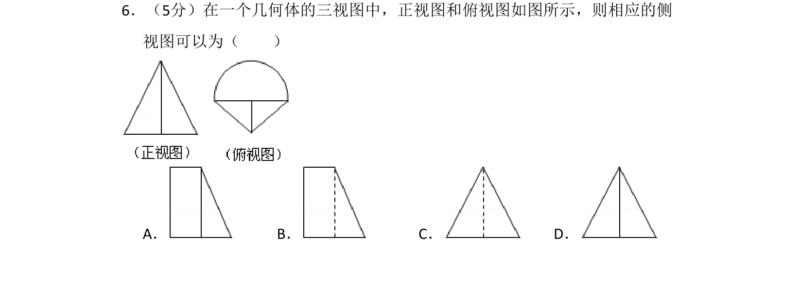
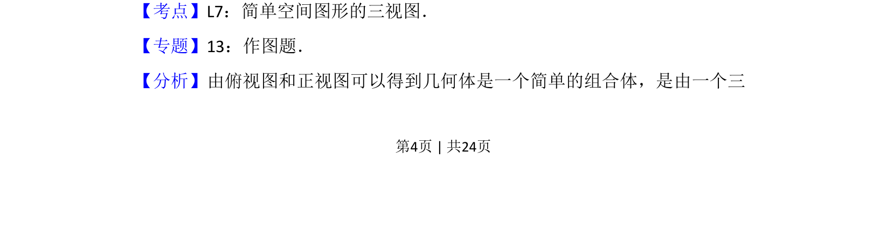
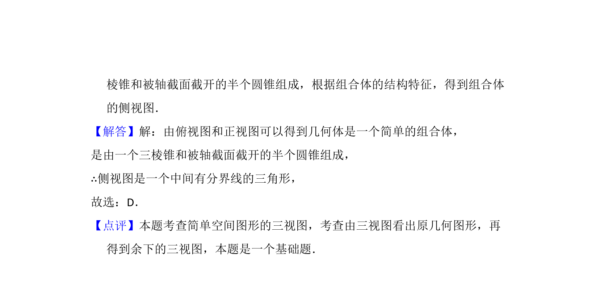

## 题面

## 摘要

由正视图和俯视图推断简单组合体的侧视图，考查三视图的识别与作图。

## 关联考点

- [[235-三视图|三视图]]
- [[1202-简单空间图形|简单空间图形]]
- [[345-直观图斜二测画法|直观图]]

## 答案与解析

> 📄 原 PDF 第 4 页：`素材/真题/吉林/2008-2024·（吉林）数学高考真题/2011年高考数学试卷（理）（新课标）（解析卷）.pdf`
