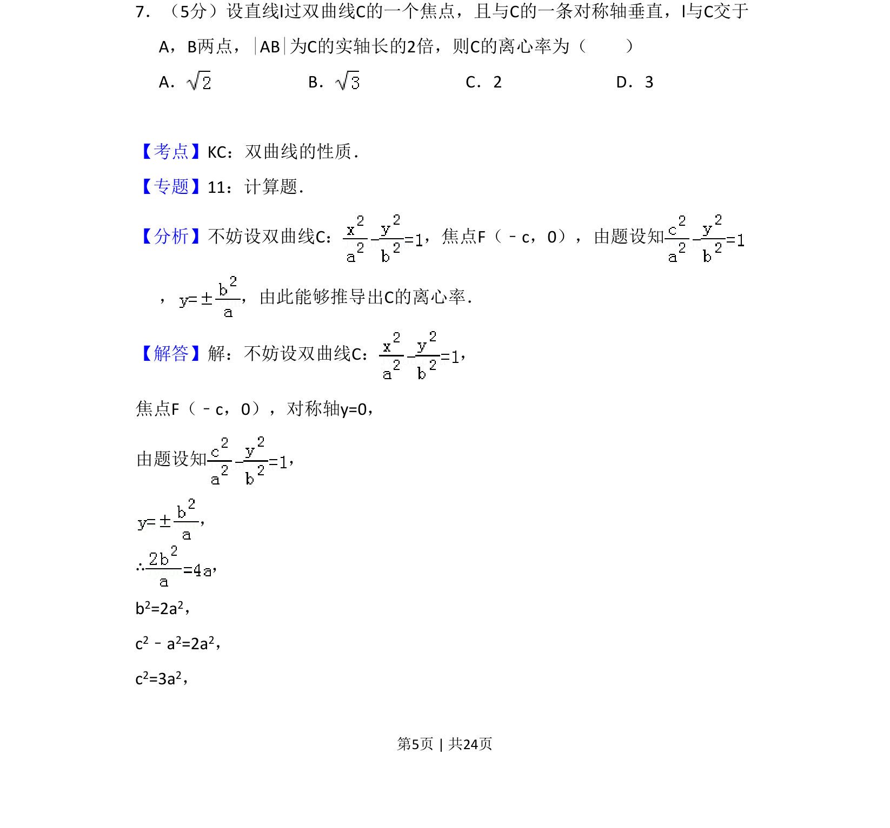
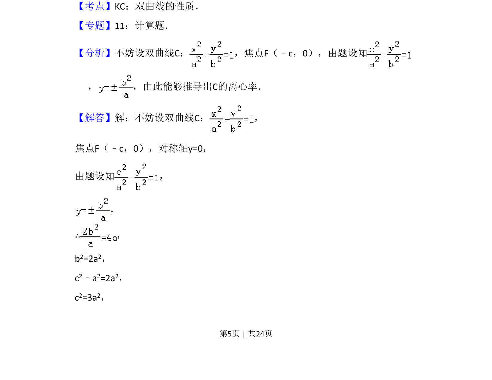
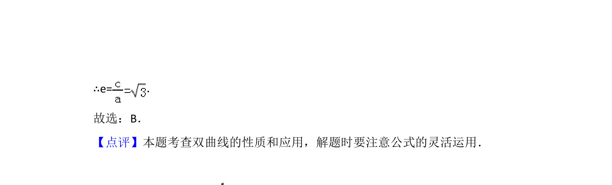

## 题面

## 摘要

该题通过直线与双曲线相交得到弦长关系，求双曲线离心率。

## 关联考点

- [[367-双曲线几何性质|双曲线性质]]
- [[867-弦长公式|弦长公式]]
- [[1037-离心率计算|离心率计算]]

## 答案与解析

> 📄 原 PDF 第 5 页：`素材/真题/吉林/2008-2024·（吉林）数学高考真题/2011年高考数学试卷（理）（新课标）（解析卷）.pdf`

<!-- 题干文本-start -->
## 题干文本
7．（5分）设直线l过双曲线C的一个焦点，且与C的一条对称轴垂直，l与C交于 
A，B两点，|AB|为C的实轴长的2倍，则C的离心率为（　　）
A．B．C．2 D．3
<!-- 题干文本-end -->

<!-- 解析文本-start -->
## 解析文本
【考点】KC：双曲线的性质．菁优网版权所有
【专题】11：计算题．
【分析】不妨设双曲线C： ，焦点F（﹣c，0），由题设知
， ，由此能够推导出C的离心率．
【解答】解：不妨设双曲线C： ，
焦点F（﹣c，0），对称轴y=0，
由题设知 ，
，
∴，
b2=2a2，
c2﹣a2=2a2，
c2=3a2，
<!-- 解析文本-end -->
