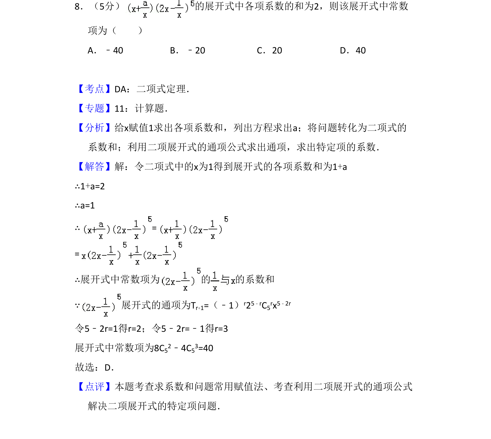

## 题面

## 摘要

本题考查二项式定理中求展开式各项系数和及特定常数项，涉及赋值法和通项公式的应用。

## 关联考点

- [[472-二项式定理|二项式定理]]
- [[赋值法求系数和]]
- [[通项公式求特定项]]

## 答案与解析

> 📄 原 PDF 第 6 页：`素材/真题/吉林/2008-2024·（吉林）数学高考真题/2011年高考数学试卷（理）（新课标）（解析卷）.pdf`
