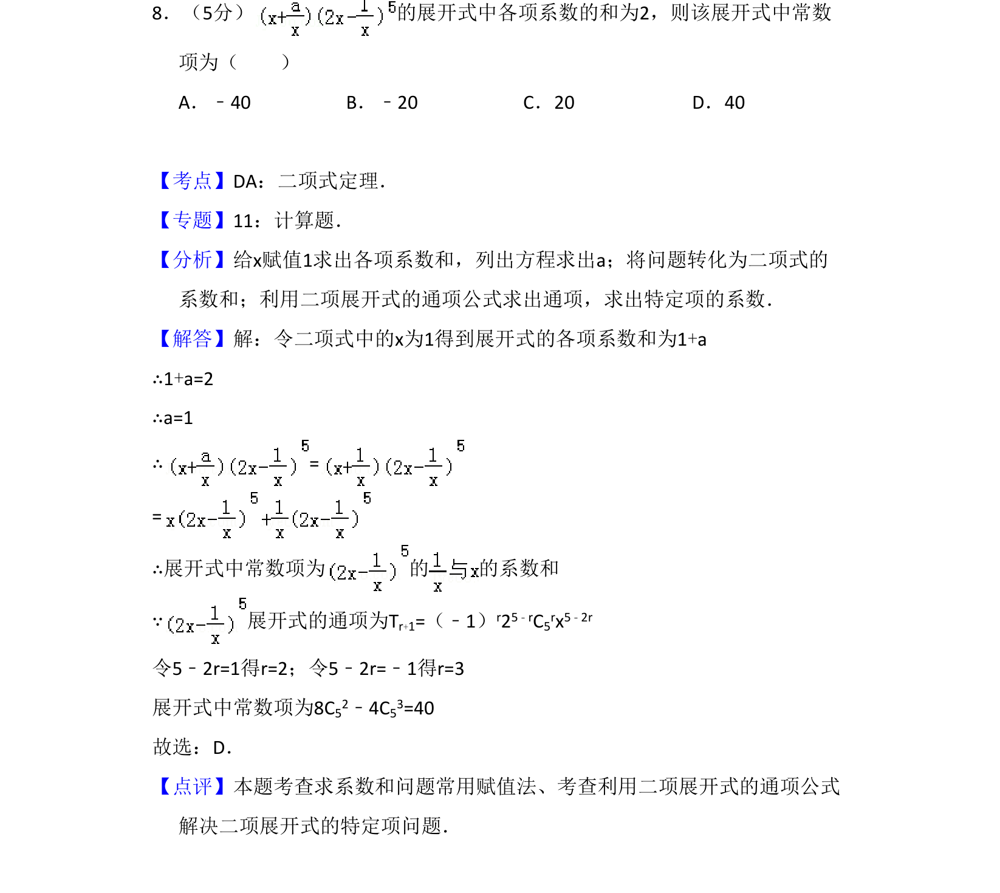
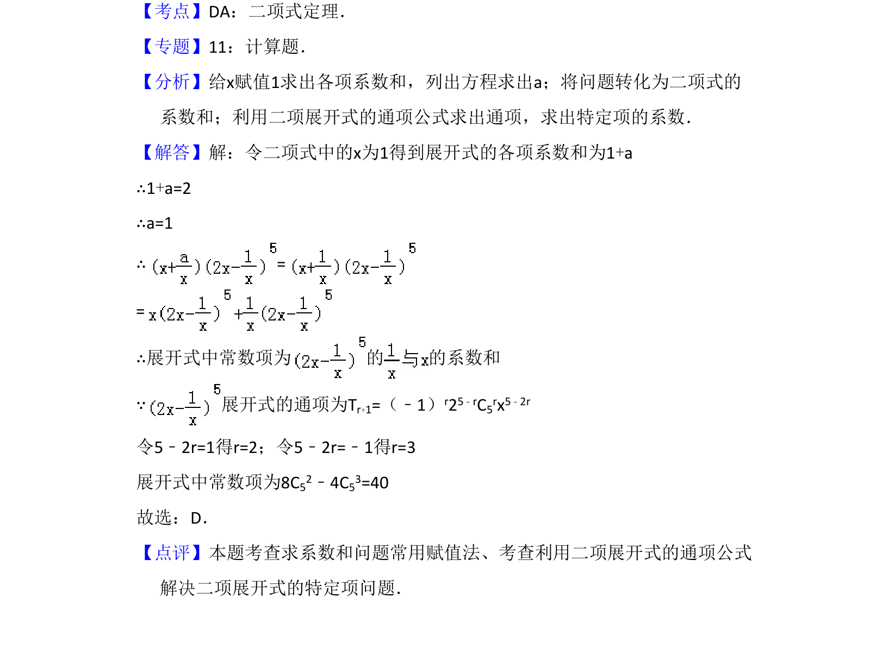

## 题面

## 摘要

本题考查二项式定理中求展开式各项系数和及特定常数项，涉及赋值法和通项公式的应用。

## 关联考点

- [[472-二项式定理|二项式定理]]
- [[1118-赋值法求系数和|赋值法求系数和]]
- [[1129-通项公式求特定项|通项公式求特定项]]

## 答案与解析

> 📄 原 PDF 第 6 页：`素材/真题/吉林/2008-2024·（吉林）数学高考真题/2011年高考数学试卷（理）（新课标）（解析卷）.pdf`

<!-- 题干文本-start -->
## 题干文本
8．（5分） 的展开式中各项系数的和为2，则该展开式中常数
项为（　　）
A．﹣40 B．﹣20 C．20 D．40
<!-- 题干文本-end -->

<!-- 解析文本-start -->
## 解析文本
【考点】DA：二项式定理．菁优网版权所有
【专题】11：计算题．
【分析】给x赋值1求出各项系数和，列出方程求出a；将问题转化为二项式的
系数和；利用二项展开式的通项公式求出通项，求出特定项的系数．
【解答】解：令二项式中的x为1得到展开式的各项系数和为1+a
∴1+a=2
∴a=1
∴=
=
∴展开式中常数项为 的 的系数和
∵展开式的通项为T r+1=（﹣1）r25﹣rC5rx5﹣2r
令5﹣2r=1得r=2；令5﹣2r=﹣1得r=3
展开式中常数项为8C52﹣4C53=40
故选：D．
【点评】本题考查求系数和问题常用赋值法、考查利用二项展开式的通项公式
解决二项展开式的特定项问题．
<!-- 解析文本-end -->
