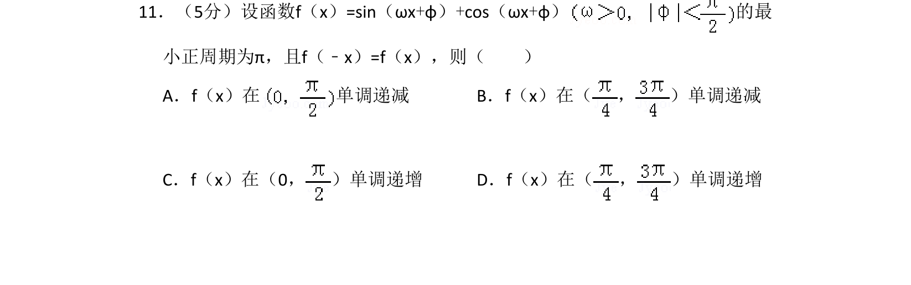
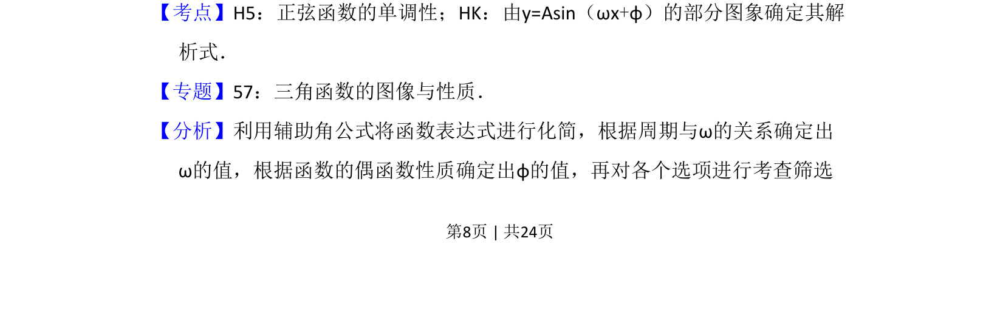
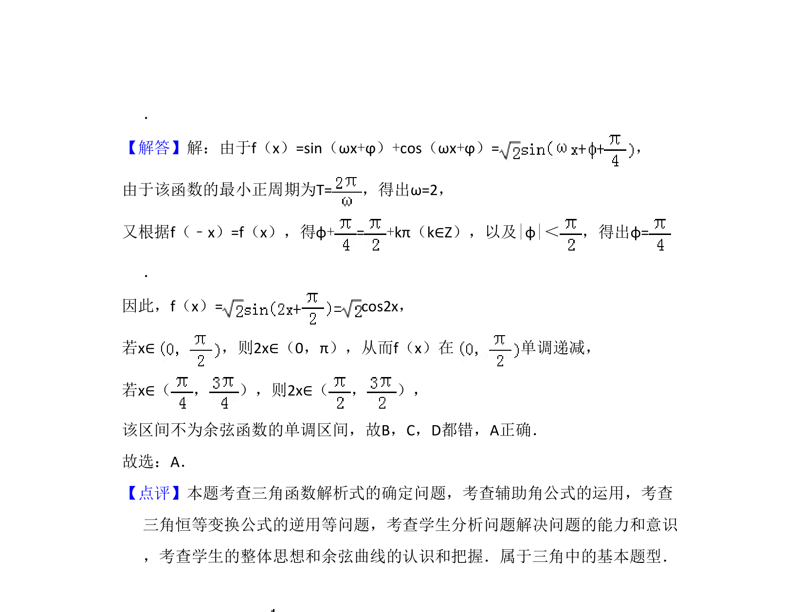

## 题面

## 摘要

本题通过辅助角公式化简三角函数，利用最小正周期和偶函数性质确定参数，进而判断单调区间。

## 关联考点

- [[962-正弦函数的单调性|正弦函数的单调性]]
- [[996-由y=Asin(ωx+φ)的部分图象确定解析式|由y=Asin(ωx+φ)的部分图象确定解析式]]
- [[1127-辅助角公式|辅助角公式]]
- [[679-函数奇偶性|函数奇偶性]]

## 答案与解析

> 📄 原 PDF 第 8 页：`素材/真题/吉林/2008-2024·（吉林）数学高考真题/2011年高考数学试卷（理）（新课标）（解析卷）.pdf`
