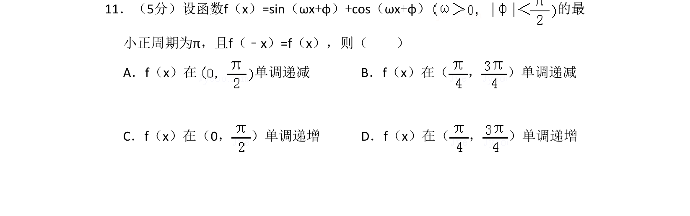
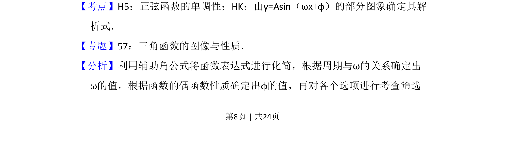
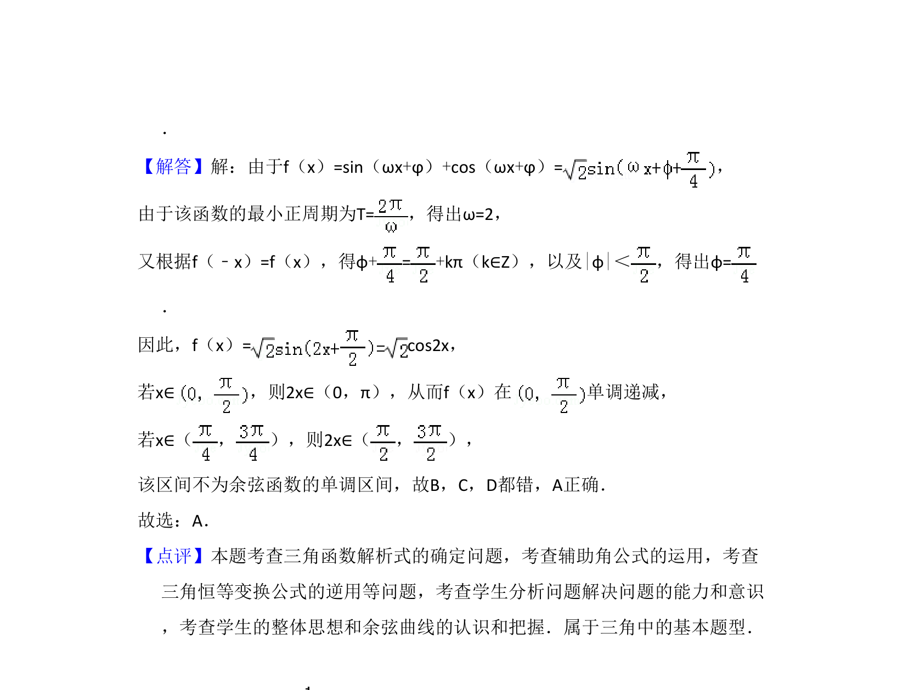

## 题面

## 摘要

本题通过辅助角公式化简三角函数，利用最小正周期和偶函数性质确定参数，进而判断单调区间。

## 关联考点

- [[961-正弦函数的单调性|正弦函数的单调性]]
- [[995-由y=Asin(ωx+φ)的部分图象确定解析式|由y=Asin(ωx+φ)的部分图象确定解析式]]
- [[1126-辅助角公式|辅助角公式]]
- [[284-函数的奇偶性|函数奇偶性]]

## 答案与解析

> 📄 原 PDF 第 8 页：`素材/真题/吉林/2008-2024·（吉林）数学高考真题/2011年高考数学试卷（理）（新课标）（解析卷）.pdf`

<!-- 题干文本-start -->
## 题干文本
11．（5分）设函数f（x）=sin（ωx+φ）+cos（ωx+φ） 的最
小正周期为π，且f（﹣x）=f（x），则（　　）
A．f（x）在 单调递减B．f（x）在（ ， ）单调递减
C．f（x）在（0， ）单调递增D．f（x）在（ ， ）单调递增
<!-- 题干文本-end -->

<!-- 解析文本-start -->
## 解析文本
【考点】H5：正弦函数的单调性；HK：由y=Asin（ωx+φ）的部分图象确定其解
析式．菁优网版权所有
【专题】57：三角函数的图像与性质．
【分析】利用辅助角公式将函数表达式进行化简，根据周期与ω的关系确定出
ω的值，根据函数的偶函数性质确定出φ的值，再对各个选项进行考查筛选
<!-- 解析文本-end -->
