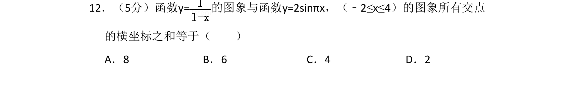
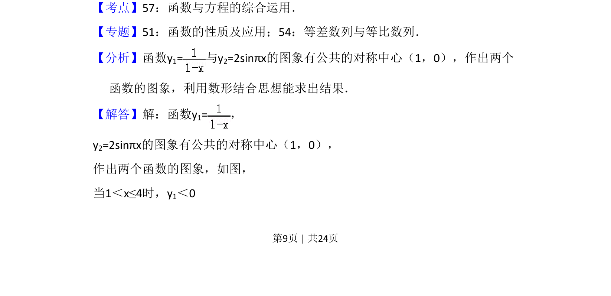
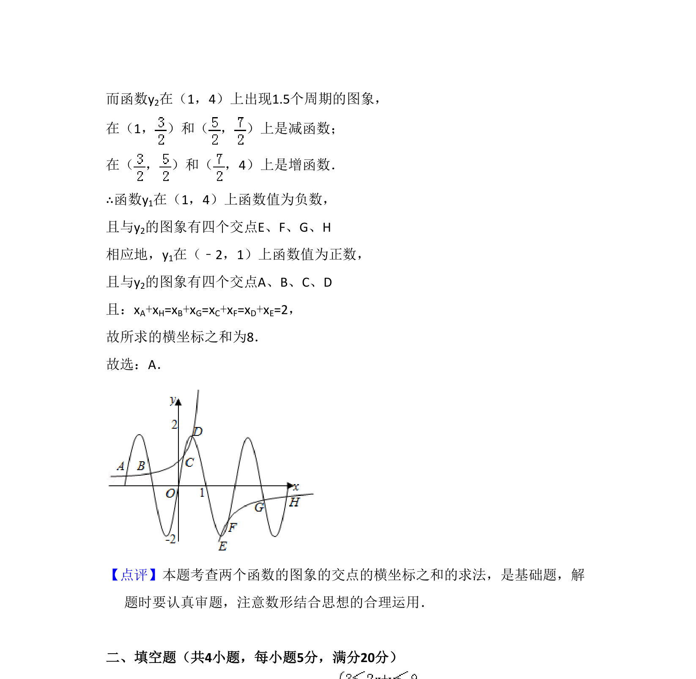

## 题面

## 摘要

函数图象有公共对称中心，求两函数交点横坐标之和。

## 关联考点

- [[675-函数与方程综合运用|函数与方程综合运用]]
- [[897-数形结合|数形结合]]
- [[835-对称性|对称性]]

## 答案与解析

> 📄 原 PDF 第 9 页：`素材/真题/吉林/2008-2024·（吉林）数学高考真题/2011年高考数学试卷（理）（新课标）（解析卷）.pdf`
