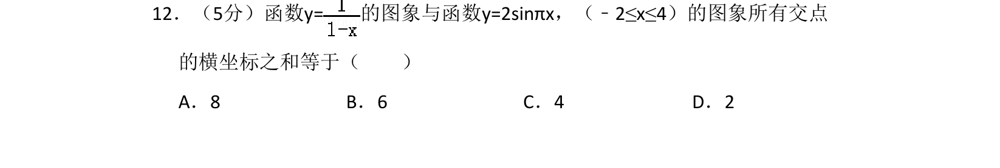
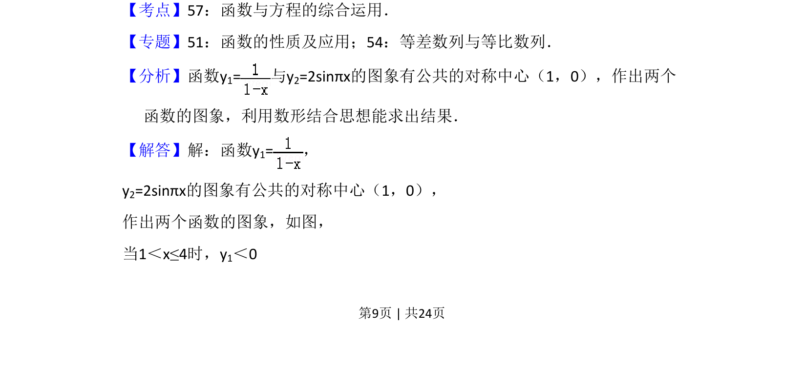
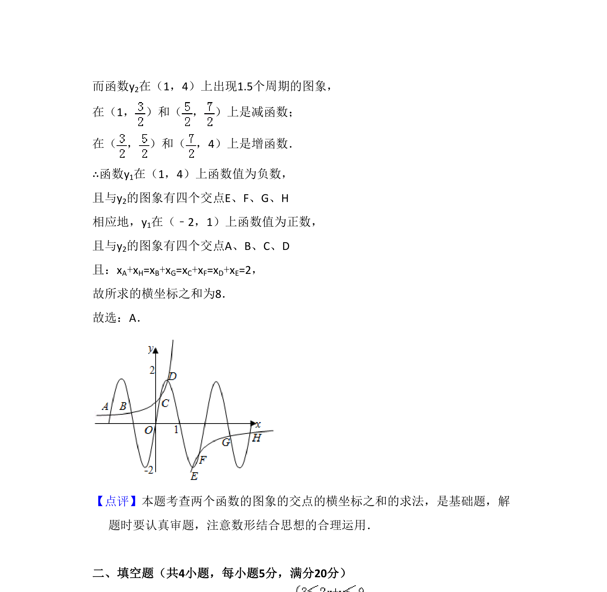

## 题面

## 摘要

函数图象有公共对称中心，求两函数交点横坐标之和。

## 关联考点

- [[675-函数与方程综合运用|函数与方程综合运用]]
- [[897-数形结合|数形结合]]
- [[835-对称性|对称性]]

## 答案与解析

> 📄 原 PDF 第 9 页：`素材/真题/吉林/2008-2024·（吉林）数学高考真题/2011年高考数学试卷（理）（新课标）（解析卷）.pdf`

<!-- 题干文本-start -->
## 题干文本
12．（5分）函数y=的图象与函数y=2sinπx，（﹣2≤x≤4）的图象所有交点
的横坐标之和等于（　　）
A．8 B．6 C．4 D．2
<!-- 题干文本-end -->

<!-- 解析文本-start -->
## 解析文本
【考点】57：函数与方程的综合运用．菁优网版权所有
【专题】51：函数的性质及应用；54：等差数列与等比数列．
【分析】函数y1=与y 2=2sinπx的图象有公共的对称中心（1，0），作出两个
函数的图象，利用数形结合思想能求出结果．
【解答】解：函数y1=，
y2=2sinπx的图象有公共的对称中心（1，0），
作出两个函数的图象，如图，
当1＜x≤4时，y1＜0
<!-- 解析文本-end -->
