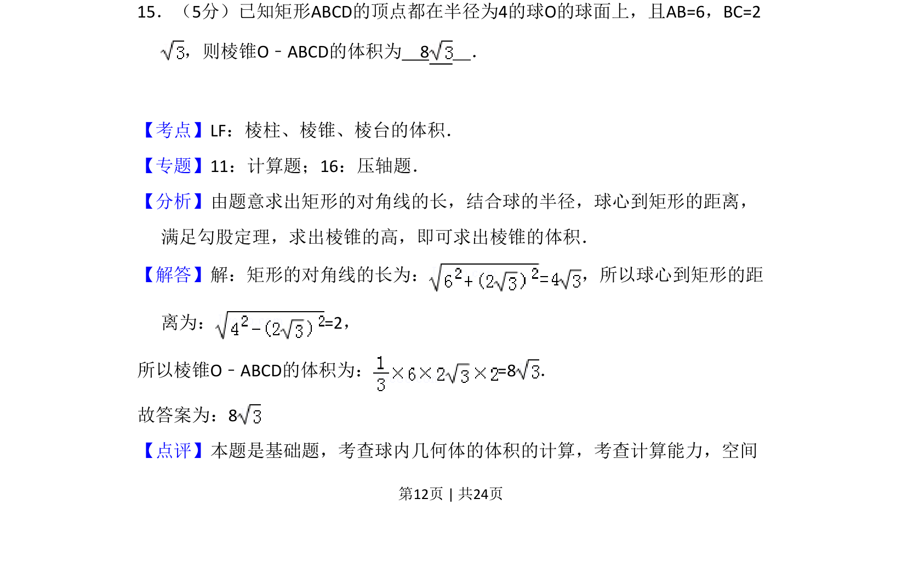
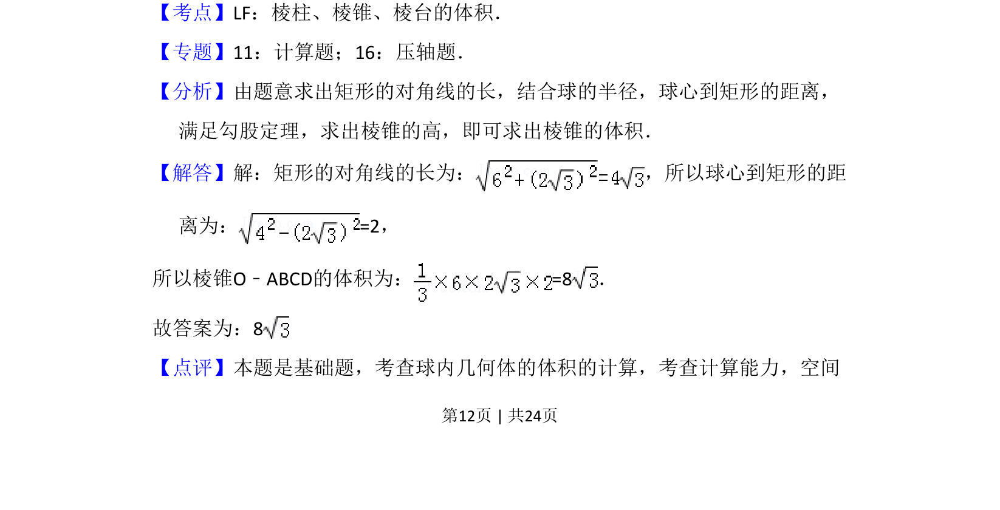

## 题面

## 摘要

矩形内接于球，利用勾股定理求球心到面距离，计算棱锥体积。

## 关联考点

- [[938-棱锥的体积|棱锥的体积]]
- [[1197-球内接几何体|球内接几何体]]
- [[189-勾股定理|勾股定理]]

## 答案与解析

> 📄 原 PDF 第 12 页：`素材/真题/吉林/2008-2024·（吉林）数学高考真题/2011年高考数学试卷（理）（新课标）（解析卷）.pdf`
