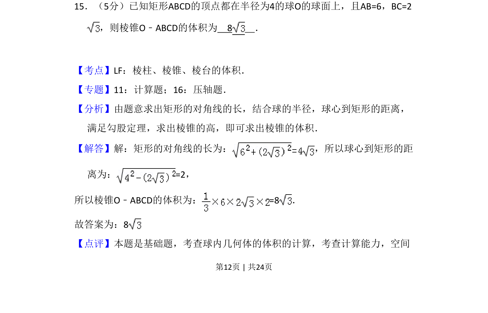
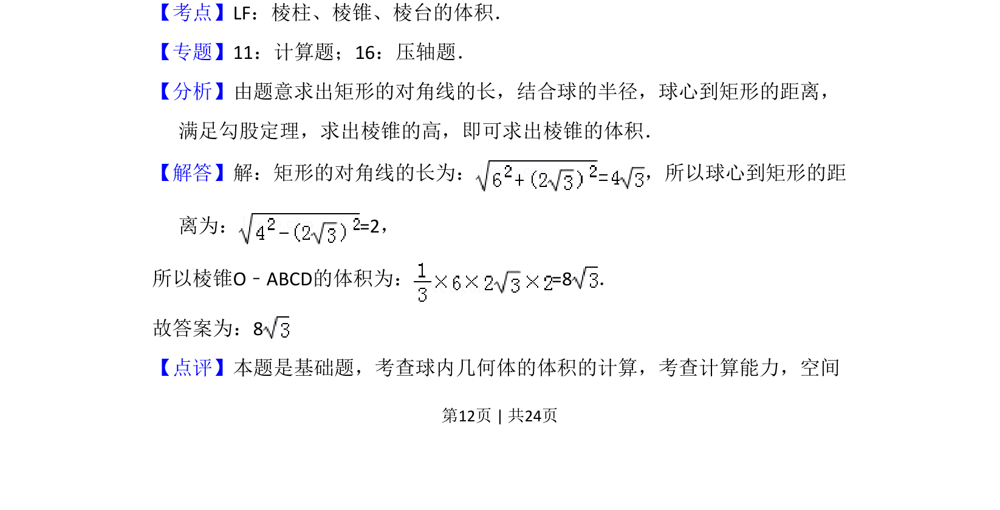

## 题面

## 摘要

矩形内接于球，利用勾股定理求球心到面距离，计算棱锥体积。

## 关联考点

- [[936-棱锥体积|棱锥的体积]]
- [[1197-球内接几何体|球内接几何体]]
- [[189-勾股定理|勾股定理]]

## 答案与解析

> 📄 原 PDF 第 12 页：`素材/真题/吉林/2008-2024·（吉林）数学高考真题/2011年高考数学试卷（理）（新课标）（解析卷）.pdf`

<!-- 题干文本-start -->
## 题干文本
15．（5分）已知矩形ABCD的顶点都在半径为4的球O的球面上，且AB=6，BC=2
，则棱锥O﹣ABCD的体积为　8 　．
<!-- 题干文本-end -->

<!-- 解析文本-start -->
## 解析文本
【考点】LF：棱柱、棱锥、棱台的体积．菁优网版权所有
【专题】11：计算题；16：压轴题．
【分析】由题意求出矩形的对角线的长，结合球的半径，球心到矩形的距离，
满足勾股定理，求出棱锥的高，即可求出棱锥的体积．
【解答】解：矩形的对角线的长为： ，所以球心到矩形的距
离为：=2，
所以棱锥O﹣ABCD的体积为：=8．
故答案为：8
【点评】本题是基础题，考查球内几何体的体积的计算，考查计算能力，空间
<!-- 解析文本-end -->
