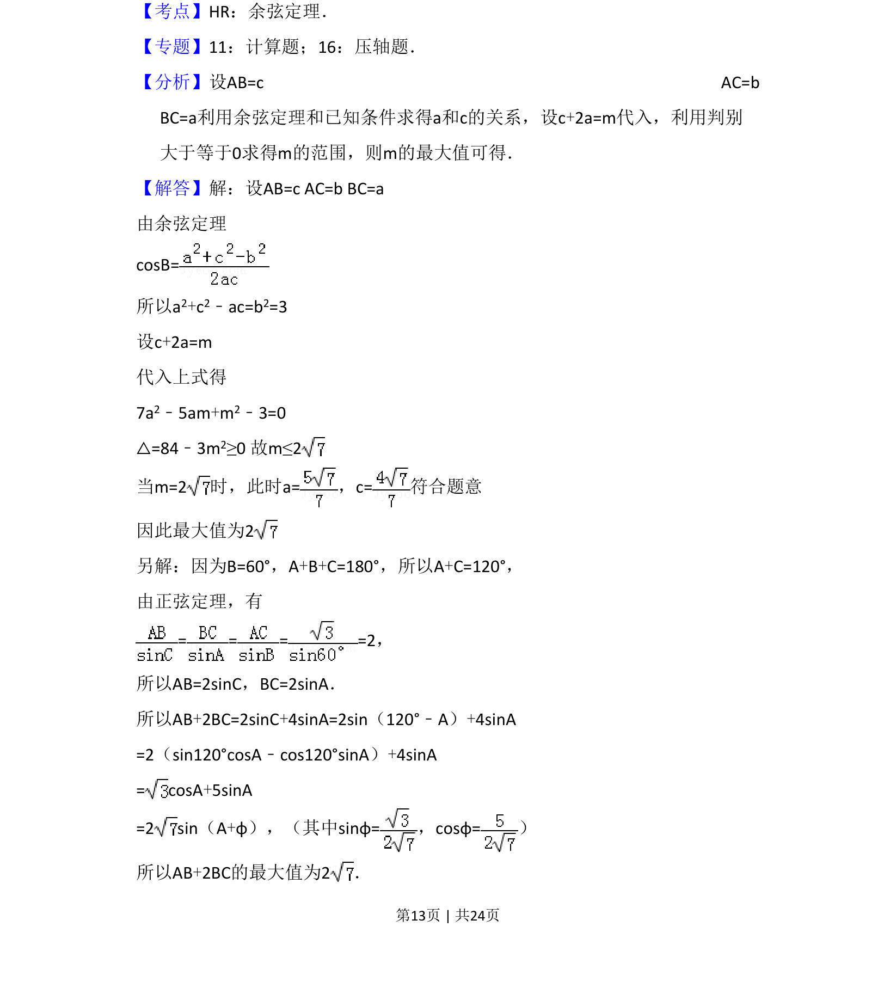
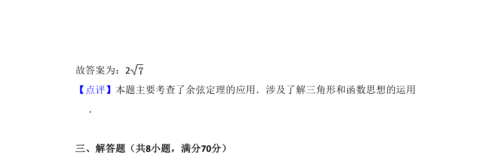

## 题面

## 摘要

在△ABC中已知一角一边，求两边线性组合的最大值，可用余弦定理结合判别式或正弦定理化三角函数求解。

## 关联考点

- [[126-定理|余弦定理]]
- [[126-定理|正弦定理]]
- [[615-三角函数的最值|三角函数最值]]
- [[704-判别式法|判别式法]]

## 答案与解析

> 📄 原 PDF 第 13 页：`素材/真题/吉林/2008-2024·（吉林）数学高考真题/2011年高考数学试卷（理）（新课标）（解析卷）.pdf`

<!-- 题干文本-start -->
## 题干文本
16．（5分）在△ABC中，B=60°，AC=，则AB+2BC的最大值为　2 　．
<!-- 题干文本-end -->

<!-- 解析文本-start -->
## 解析文本
【考点】HR：余弦定理．菁优网版权所有
【专题】11：计算题；16：压轴题．
【分析】设AB=c AC=b 
BC=a利用余弦定理和已知条件求得a和c的关系，设c+2a=m代入，利用判别
大于等于0求得m的范围，则m的最大值可得．
【解答】解：设AB=c AC=b BC=a
由余弦定理
cosB=
所以a2+c2﹣ac=b2=3
设c+2a=m          
代入上式得
7a2﹣5am+m2﹣3=0
△=84﹣3m2≥0 故m≤2
当m=2时，此时a=，c=符合题意
因此最大值为2
另解：因为B=60°，A+B+C=180°，所以A+C=120°，
由正弦定理，有
= = = =2，
所以AB=2sinC，BC=2sinA．
所以AB+2BC=2sinC+4sinA=2sin（120°﹣A）+4sinA
=2（sin120°cosA﹣cos120°sinA）+4sinA
= cosA+5sinA
=2 sin（A+φ），（其中sinφ=，cosφ=）
所以AB+2BC的最大值为2．
<!-- 解析文本-end -->
