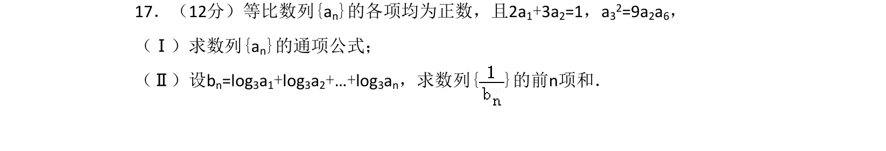
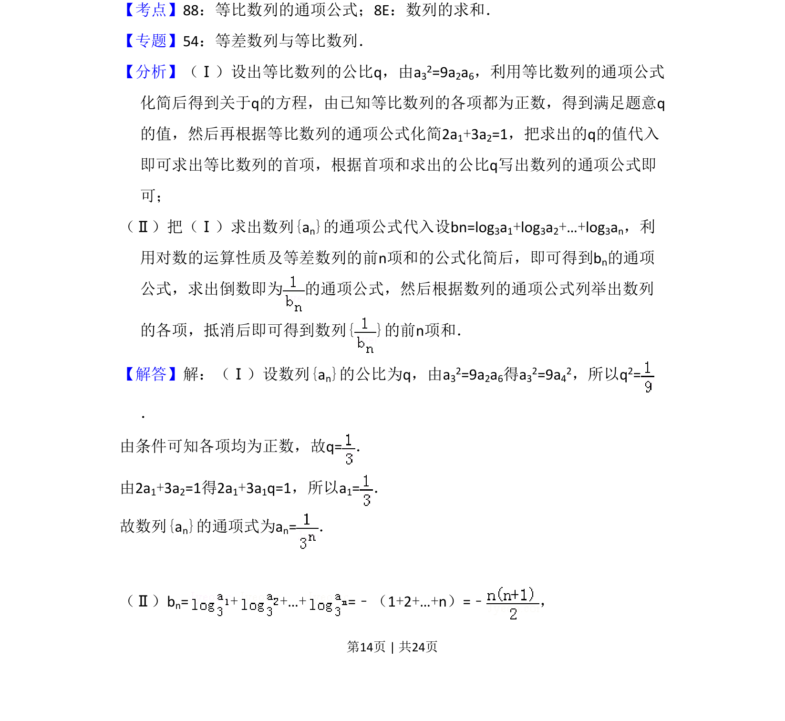
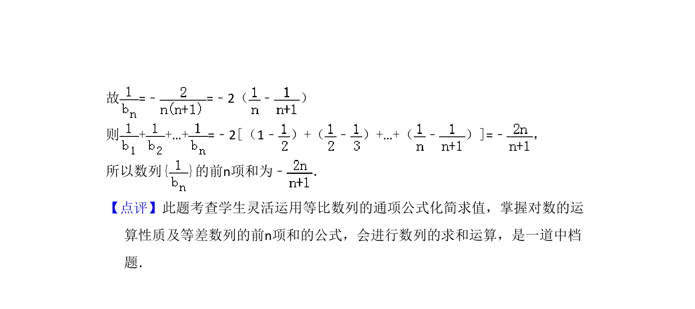

## 题面

## 摘要

求等比数列通项公式及利用对数运算和裂项相消法求数列前n项和

## 关联考点

- [[1070-等比数列通项公式|等比数列的通项公式]]
- [[893-数列的求和|数列的求和]]
- [[382-数列裂项相消|裂项相消法]]
- [[832-对数运算|对数运算]]

## 答案与解析

> 📄 原 PDF 第 14 页：`素材/真题/吉林/2008-2024·（吉林）数学高考真题/2011年高考数学试卷（理）（新课标）（解析卷）.pdf`

<!-- 题干文本-start -->
## 题干文本
17．（12分）等比数列{an}的各项均为正数，且2a1+3a2=1，a32=9a2a6，
（Ⅰ）求数列{an}的通项公式；
（Ⅱ）设bn=log3a1+log3a2+…+log3an，求数列{ }的前n项和．
<!-- 题干文本-end -->

<!-- 解析文本-start -->
## 解析文本
【考点】88：等比数列的通项公式；8E：数列的求和．菁优网版权所有
【专题】54：等差数列与等比数列．
【分析】（Ⅰ）设出等比数列的公比q，由a32=9a2a6，利用等比数列的通项公式
化简后得到关于q的方程，由已知等比数列的各项都为正数，得到满足题意q
的值，然后再根据等比数列的通项公式化简2a1+3a2=1，把求出的q的值代入
即可求出等比数列的首项，根据首项和求出的公比q写出数列的通项公式即
可；
（Ⅱ）把（Ⅰ）求出数列{an}的通项公式代入设bn=log3a1+log3a2+…+log3an，利
用对数的运算性质及等差数列的前n项和的公式化简后，即可得到bn的通项
公式，求出倒数即为 的通项公式，然后根据数列的通项公式列举出数列
的各项，抵消后即可得到数列{ }的前n项和．
【解答】解：（Ⅰ）设数列{an}的公比为q，由a32=9a2a6得a32=9a42，所以q2=
．
由条件可知各项均为正数，故q=．
由2a1+3a2=1得2a1+3a1q=1，所以a1=．
故数列{an}的通项式为an=．
（Ⅱ）bn=+ +…+=﹣（1+2+…+n）=﹣ ，
<!-- 解析文本-end -->
