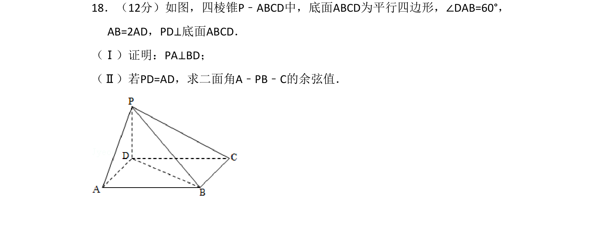
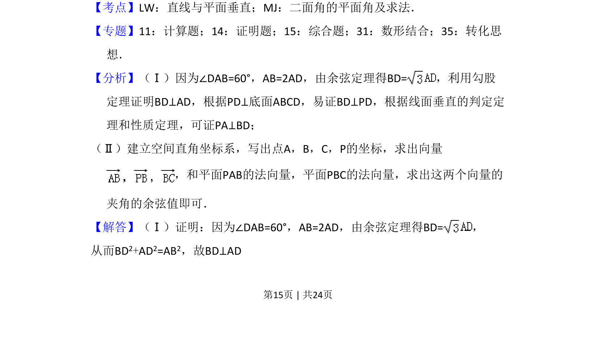
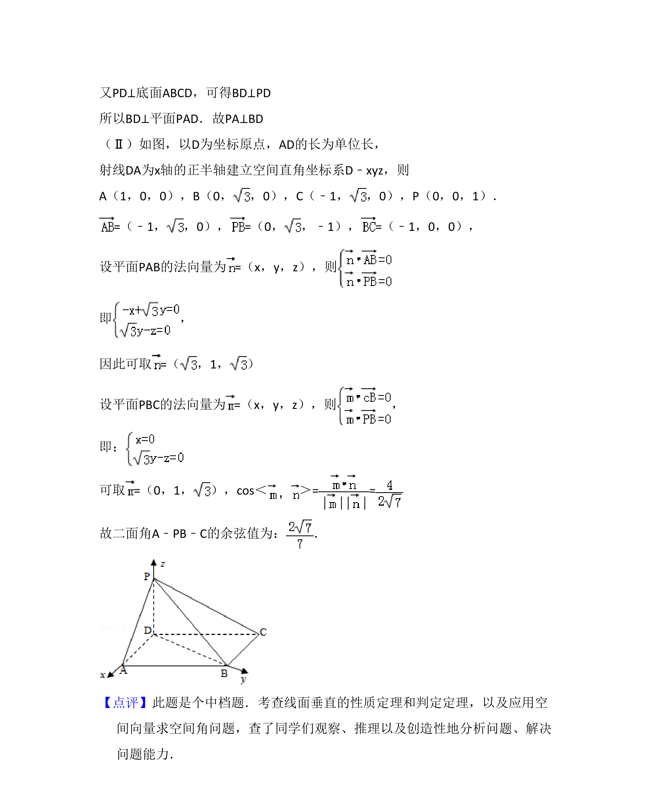

## 题面

## 摘要

四棱锥中证明线线垂直并求二面角余弦值，涉及线面垂直判定与空间向量法。

## 关联考点

- [[1010-直线与平面垂直|直线与平面垂直]]
- [[643-二面角的平面角及求法|二面角的平面角及求法]]

## 答案与解析

> 📄 原 PDF 第 15 页：`素材/真题/吉林/2008-2024·（吉林）数学高考真题/2011年高考数学试卷（理）（新课标）（解析卷）.pdf`
