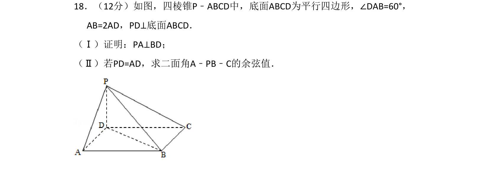
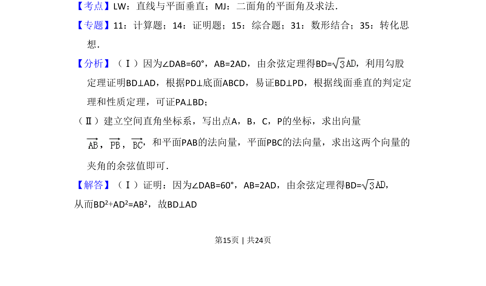
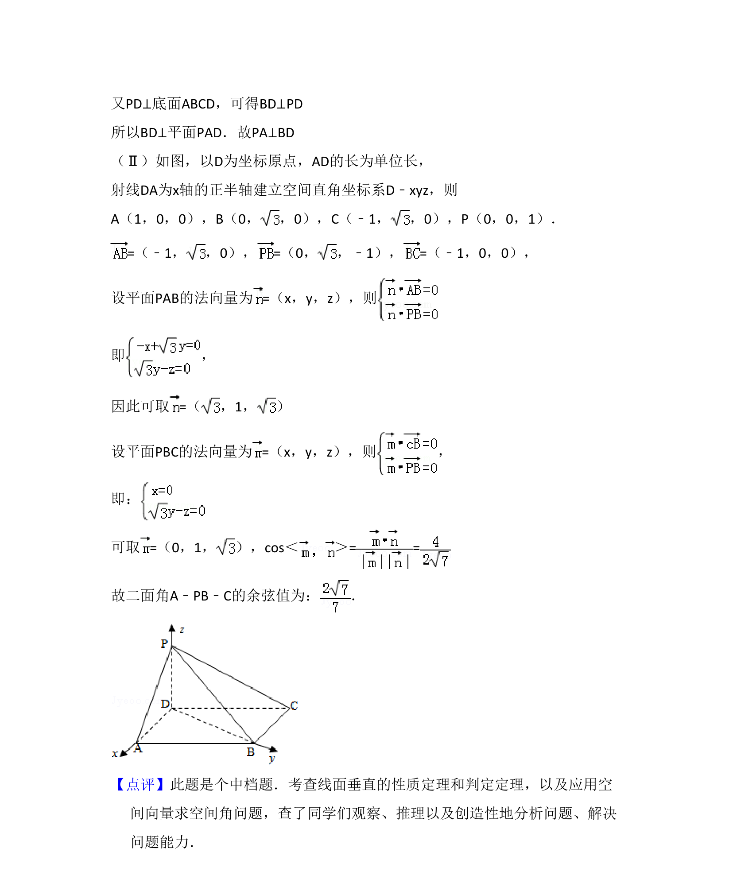

## 题面

## 摘要

四棱锥中证明线线垂直并求二面角余弦值，涉及线面垂直判定与空间向量法。

## 关联考点

- [[1010-直线与平面垂直|直线与平面垂直]]
- [[643-二面角的平面角及求法|二面角的平面角及求法]]

## 答案与解析

> 📄 原 PDF 第 15 页：`素材/真题/吉林/2008-2024·（吉林）数学高考真题/2011年高考数学试卷（理）（新课标）（解析卷）.pdf`

<!-- 题干文本-start -->
## 题干文本
18．（12分）如图，四棱锥P﹣ABCD中，底面ABCD为平行四边形，∠DAB=60°，
AB=2AD，PD⊥底面ABCD．
（Ⅰ）证明：PA⊥BD；
（Ⅱ）若PD=AD，求二面角A﹣PB﹣C的余弦值．
<!-- 题干文本-end -->

<!-- 解析文本-start -->
## 解析文本
【考点】LW：直线与平面垂直；MJ：二面角的平面角及求法．菁优网版权所有
【专题】11：计算题；14：证明题；15：综合题；31：数形结合；35：转化思
想．
【分析】（Ⅰ）因为∠DAB=60°，AB=2AD，由余弦定理得BD=，利用勾股
定理证明BD⊥AD，根据PD⊥底面ABCD，易证BD⊥PD，根据线面垂直的判定定
理和性质定理，可证PA⊥BD；
（Ⅱ）建立空间直角坐标系，写出点A，B，C，P的坐标，求出向量
，和平面PAB的法向量，平面PBC的法向量，求出这两个向量的
夹角的余弦值即可．
【解答】（Ⅰ）证明：因为∠DAB=60°，AB=2AD，由余弦定理得BD=，
从而BD2+AD2=AB2，故BD⊥AD
<!-- 解析文本-end -->
