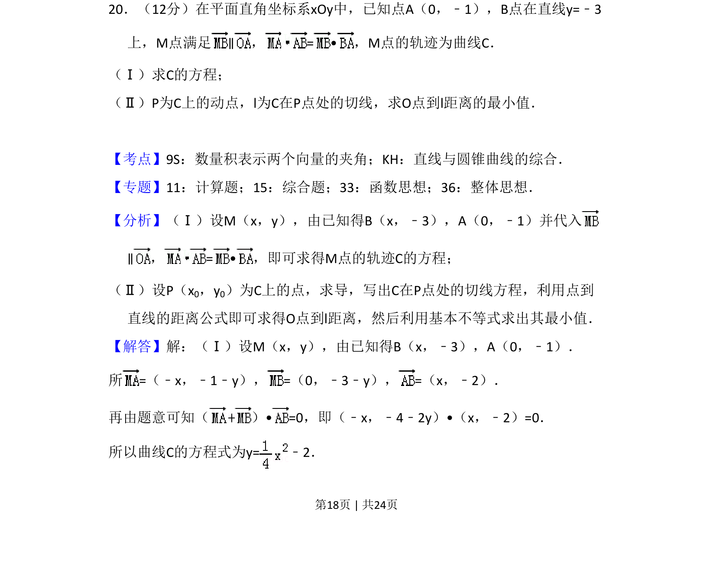
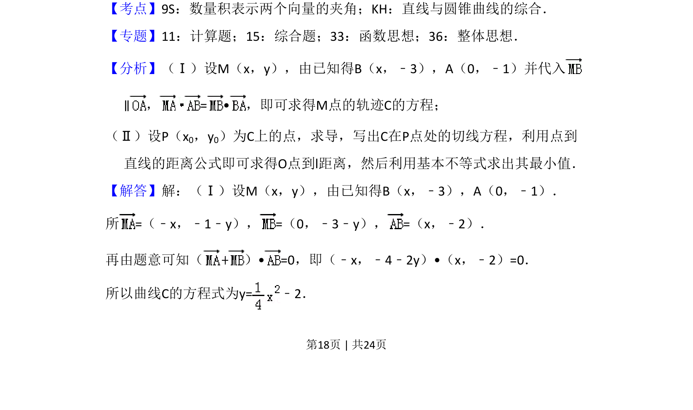
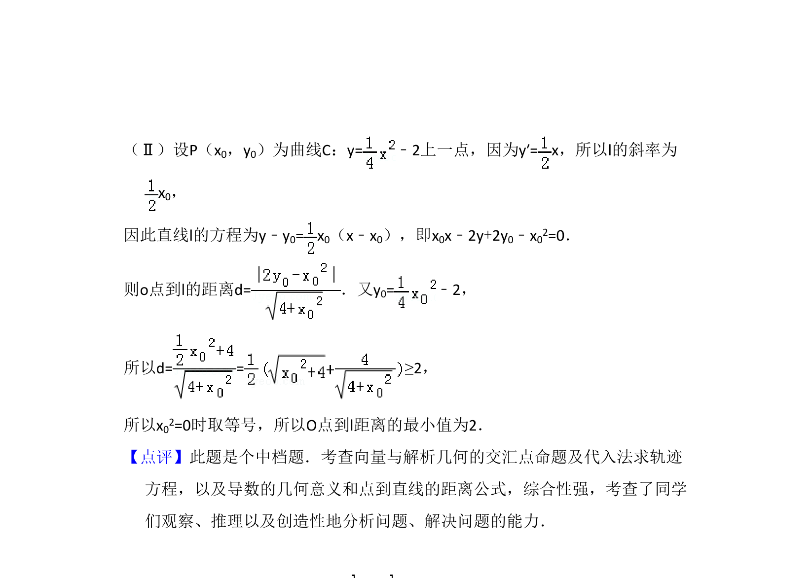

## 题面

## 摘要

本题考查利用向量条件求轨迹方程，以及抛物线的切线方程和点到直线距离的最值问题。

## 关联考点

- [[595-数量积表示两个向量的夹角|数量积表示两个向量的夹角]]
- [[1007-直线与圆锥曲线的综合|直线与圆锥曲线的综合]]
- [[376-圆锥曲线轨迹问题|轨迹方程]]
- [[422-切线方程|切线方程]]

## 答案与解析

> 📄 原 PDF 第 18 页：`素材/真题/吉林/2008-2024·（吉林）数学高考真题/2011年高考数学试卷（理）（新课标）（解析卷）.pdf`
